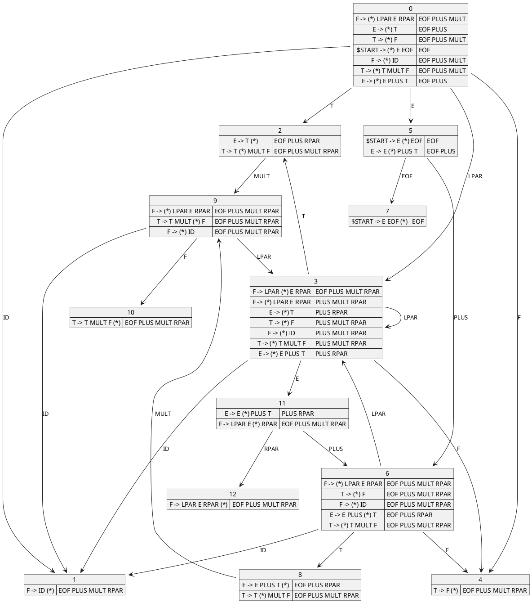
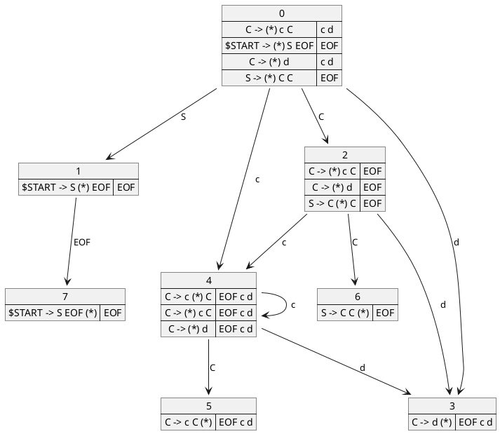
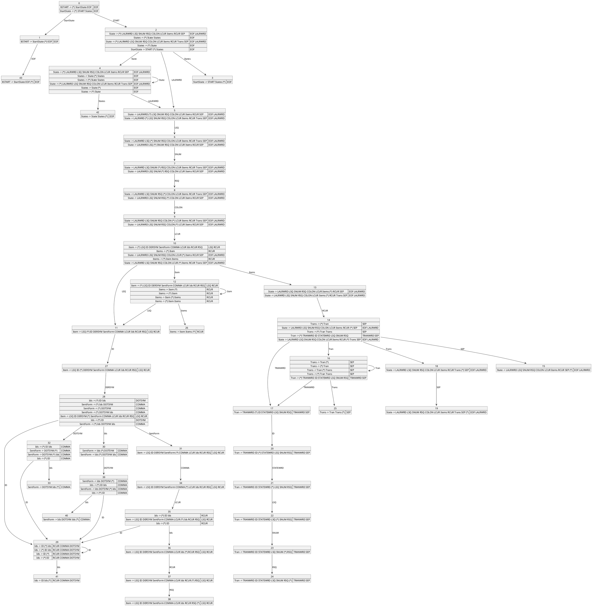

# CupStatesToDiagram

## Description

CupStatesToDiagram is a program to translate the Cup's states debug output to different
diagrams. It can be helpful when trying to resolve conflicts or wanting to see the LALR state
diagram of a grammar. It can be used in the learning process to verify that the drawn state
diagram of a grammar is correct.

CupStatesToDiagram was written in Java, JFlex and Cup were used to parse the Cup's states
debug output.

## Usage

Java 17 is required to be installed.

CupStatesToDiagram can be easily used by downloading the *CupStatesToDiagram-0.1.jar* file in the
*Releases* section and running:

```bash
java -jar CupStatesToDiagram-0.1.jar
```

Alternatively, you can clone the repository and run `mvn package` to generate locally the jar.
The jar will be saved in the `target` directory.

## Arguments

```
usage: CupStatesToDiagram [-h] [-i I] [-o O] [--graphviz | --plantuml |
                           --nomnoml | --debug]

Translate Cup's states in the debug output to diagrams.

named arguments:
  -h, --help             show this help message and exit
  -i I                   Take the input from a file.
  -o O                   Output to a file.

Diagram type:
  --graphviz             Create  a  Graphviz   diagram   in  dot  language.
                         (Default)
  --plantuml             Create a PlantUML diagram in its language.
  --debug                Debug the Lexer and Parser.  The input will run on
                         both and produce the Cup's states debug output.
```

You can paste the Cup's states output to *stdin* or specify with `-i` a file path where it was
saved.

The output has the same options. By default, it will be printed to the *stdout* but the option
`-o` can be used to specify a file path where to write it.

### Diagram choice

Two types of diagrams are supported, but only *Graphviz* support large diagrams. *PlantUML*
theoretically supports it too, but you need a self-hosted version and tweak some config files.

For *Graphiz* I suggest copying the generated *dot lang* output and using an online *Graphiz Visual
Editor* like [graphviz-visual-editor](https://github.com/magjac/graphviz-visual-editor) to
navigate a large diagram. Exporting the diagram in SVG allows one to open it in a browser and
search for states and items.

## Examples

### Example 1
#### Input
The [input4.txt](src/test_files/input4.txt) represents the LALR states of the well known grammar in 
below:
<details>
<summary>Grammar</summary>

```
E -> E PLUS T
E -> T
T -> T MULT F
T -> F
F -> LPAR E RPAR
F -> ID 
```
</details>

#### Output
<details>
<summary>Graphvix's dot language</summary>

```
digraph g {
  fontname="Helvetica,Arial,sans-serif"
  node [fontname="Helvetica,Arial,sans-serif"]
  edge [fontname="Helvetica,Arial,sans-serif"]
  graph [fontsize=30 labelloc="t" label="" splines=true overlap=false ];
  ratio = auto;
"state0" [ style = "filled" penwidth = 1 fillcolor = "white" fontname = "Courier New" shape = "Mrecord" label =<<table border="0" cellborder="0" cellpadding="3" bgcolor="white"><tr><td bgcolor="black" align="center" colspan="2"><font color="white">State #0</font></td></tr><tr><td align="left">F -&gt; &bull; LPAR E RPAR </td><td bgcolor="lightgrey" align="left">EOF PLUS MULT </td></tr><tr><td align="left">E -&gt; &bull; T </td><td bgcolor="lightgrey" align="left">EOF PLUS </td></tr><tr><td align="left">T -&gt; &bull; F </td><td bgcolor="lightgrey" align="left">EOF PLUS MULT </td></tr><tr><td align="left">$START -&gt; &bull; E EOF </td><td bgcolor="lightgrey" align="left">EOF </td></tr><tr><td align="left">F -&gt; &bull; ID </td><td bgcolor="lightgrey" align="left">EOF PLUS MULT </td></tr><tr><td align="left">T -&gt; &bull; T MULT F </td><td bgcolor="lightgrey" align="left">EOF PLUS MULT </td></tr><tr><td align="left">E -&gt; &bull; E PLUS T </td><td bgcolor="lightgrey" align="left">EOF PLUS </td></tr></table>> ];
"state1" [ style = "filled" penwidth = 1 fillcolor = "white" fontname = "Courier New" shape = "Mrecord" label =<<table border="0" cellborder="0" cellpadding="3" bgcolor="white"><tr><td bgcolor="black" align="center" colspan="2"><font color="white">State #1</font></td></tr><tr><td align="left">F -&gt; ID &bull; </td><td bgcolor="lightgrey" align="left">EOF PLUS MULT RPAR </td></tr></table>> ];
"state2" [ style = "filled" penwidth = 1 fillcolor = "white" fontname = "Courier New" shape = "Mrecord" label =<<table border="0" cellborder="0" cellpadding="3" bgcolor="white"><tr><td bgcolor="black" align="center" colspan="2"><font color="white">State #2</font></td></tr><tr><td align="left">E -&gt; T &bull; </td><td bgcolor="lightgrey" align="left">EOF PLUS RPAR </td></tr><tr><td align="left">T -&gt; T &bull; MULT F </td><td bgcolor="lightgrey" align="left">EOF PLUS MULT RPAR </td></tr></table>> ];
"state3" [ style = "filled" penwidth = 1 fillcolor = "white" fontname = "Courier New" shape = "Mrecord" label =<<table border="0" cellborder="0" cellpadding="3" bgcolor="white"><tr><td bgcolor="black" align="center" colspan="2"><font color="white">State #3</font></td></tr><tr><td align="left">F -&gt; LPAR &bull; E RPAR </td><td bgcolor="lightgrey" align="left">EOF PLUS MULT RPAR </td></tr><tr><td align="left">F -&gt; &bull; LPAR E RPAR </td><td bgcolor="lightgrey" align="left">PLUS MULT RPAR </td></tr><tr><td align="left">E -&gt; &bull; T </td><td bgcolor="lightgrey" align="left">PLUS RPAR </td></tr><tr><td align="left">T -&gt; &bull; F </td><td bgcolor="lightgrey" align="left">PLUS MULT RPAR </td></tr><tr><td align="left">F -&gt; &bull; ID </td><td bgcolor="lightgrey" align="left">PLUS MULT RPAR </td></tr><tr><td align="left">T -&gt; &bull; T MULT F </td><td bgcolor="lightgrey" align="left">PLUS MULT RPAR </td></tr><tr><td align="left">E -&gt; &bull; E PLUS T </td><td bgcolor="lightgrey" align="left">PLUS RPAR </td></tr></table>> ];
"state4" [ style = "filled" penwidth = 1 fillcolor = "white" fontname = "Courier New" shape = "Mrecord" label =<<table border="0" cellborder="0" cellpadding="3" bgcolor="white"><tr><td bgcolor="black" align="center" colspan="2"><font color="white">State #4</font></td></tr><tr><td align="left">T -&gt; F &bull; </td><td bgcolor="lightgrey" align="left">EOF PLUS MULT RPAR </td></tr></table>> ];
"state5" [ style = "filled" penwidth = 1 fillcolor = "white" fontname = "Courier New" shape = "Mrecord" label =<<table border="0" cellborder="0" cellpadding="3" bgcolor="white"><tr><td bgcolor="black" align="center" colspan="2"><font color="white">State #5</font></td></tr><tr><td align="left">$START -&gt; E &bull; EOF </td><td bgcolor="lightgrey" align="left">EOF </td></tr><tr><td align="left">E -&gt; E &bull; PLUS T </td><td bgcolor="lightgrey" align="left">EOF PLUS </td></tr></table>> ];
"state6" [ style = "filled" penwidth = 1 fillcolor = "white" fontname = "Courier New" shape = "Mrecord" label =<<table border="0" cellborder="0" cellpadding="3" bgcolor="white"><tr><td bgcolor="black" align="center" colspan="2"><font color="white">State #6</font></td></tr><tr><td align="left">F -&gt; &bull; LPAR E RPAR </td><td bgcolor="lightgrey" align="left">EOF PLUS MULT RPAR </td></tr><tr><td align="left">T -&gt; &bull; F </td><td bgcolor="lightgrey" align="left">EOF PLUS MULT RPAR </td></tr><tr><td align="left">F -&gt; &bull; ID </td><td bgcolor="lightgrey" align="left">EOF PLUS MULT RPAR </td></tr><tr><td align="left">E -&gt; E PLUS &bull; T </td><td bgcolor="lightgrey" align="left">EOF PLUS RPAR </td></tr><tr><td align="left">T -&gt; &bull; T MULT F </td><td bgcolor="lightgrey" align="left">EOF PLUS MULT RPAR </td></tr></table>> ];
"state7" [ style = "filled" penwidth = 1 fillcolor = "white" fontname = "Courier New" shape = "Mrecord" label =<<table border="0" cellborder="0" cellpadding="3" bgcolor="white"><tr><td bgcolor="black" align="center" colspan="2"><font color="white">State #7</font></td></tr><tr><td align="left">$START -&gt; E EOF &bull; </td><td bgcolor="lightgrey" align="left">EOF </td></tr></table>> ];
"state8" [ style = "filled" penwidth = 1 fillcolor = "white" fontname = "Courier New" shape = "Mrecord" label =<<table border="0" cellborder="0" cellpadding="3" bgcolor="white"><tr><td bgcolor="black" align="center" colspan="2"><font color="white">State #8</font></td></tr><tr><td align="left">E -&gt; E PLUS T &bull; </td><td bgcolor="lightgrey" align="left">EOF PLUS RPAR </td></tr><tr><td align="left">T -&gt; T &bull; MULT F </td><td bgcolor="lightgrey" align="left">EOF PLUS MULT RPAR </td></tr></table>> ];
"state9" [ style = "filled" penwidth = 1 fillcolor = "white" fontname = "Courier New" shape = "Mrecord" label =<<table border="0" cellborder="0" cellpadding="3" bgcolor="white"><tr><td bgcolor="black" align="center" colspan="2"><font color="white">State #9</font></td></tr><tr><td align="left">F -&gt; &bull; LPAR E RPAR </td><td bgcolor="lightgrey" align="left">EOF PLUS MULT RPAR </td></tr><tr><td align="left">T -&gt; T MULT &bull; F </td><td bgcolor="lightgrey" align="left">EOF PLUS MULT RPAR </td></tr><tr><td align="left">F -&gt; &bull; ID </td><td bgcolor="lightgrey" align="left">EOF PLUS MULT RPAR </td></tr></table>> ];
"state10" [ style = "filled" penwidth = 1 fillcolor = "white" fontname = "Courier New" shape = "Mrecord" label =<<table border="0" cellborder="0" cellpadding="3" bgcolor="white"><tr><td bgcolor="black" align="center" colspan="2"><font color="white">State #10</font></td></tr><tr><td align="left">T -&gt; T MULT F &bull; </td><td bgcolor="lightgrey" align="left">EOF PLUS MULT RPAR </td></tr></table>> ];
"state11" [ style = "filled" penwidth = 1 fillcolor = "white" fontname = "Courier New" shape = "Mrecord" label =<<table border="0" cellborder="0" cellpadding="3" bgcolor="white"><tr><td bgcolor="black" align="center" colspan="2"><font color="white">State #11</font></td></tr><tr><td align="left">E -&gt; E &bull; PLUS T </td><td bgcolor="lightgrey" align="left">PLUS RPAR </td></tr><tr><td align="left">F -&gt; LPAR E &bull; RPAR </td><td bgcolor="lightgrey" align="left">EOF PLUS MULT RPAR </td></tr></table>> ];
"state12" [ style = "filled" penwidth = 1 fillcolor = "white" fontname = "Courier New" shape = "Mrecord" label =<<table border="0" cellborder="0" cellpadding="3" bgcolor="white"><tr><td bgcolor="black" align="center" colspan="2"><font color="white">State #12</font></td></tr><tr><td align="left">F -&gt; LPAR E RPAR &bull; </td><td bgcolor="lightgrey" align="left">EOF PLUS MULT RPAR </td></tr></table>> ];
state0-> state5[ penwidth = 1 fontsize = 14 fontcolor = "black" label = "E "];
state0-> state4[ penwidth = 1 fontsize = 14 fontcolor = "black" label = "F "];
state0-> state3[ penwidth = 1 fontsize = 14 fontcolor = "black" label = "LPAR "];
state0-> state2[ penwidth = 1 fontsize = 14 fontcolor = "black" label = "T "];
state0-> state1[ penwidth = 1 fontsize = 14 fontcolor = "black" label = "ID "];
state2-> state9[ penwidth = 1 fontsize = 14 fontcolor = "black" label = "MULT "];
state3-> state11[ penwidth = 1 fontsize = 14 fontcolor = "black" label = "E "];
state3-> state4[ penwidth = 1 fontsize = 14 fontcolor = "black" label = "F "];
state3-> state3[ penwidth = 1 fontsize = 14 fontcolor = "black" label = "LPAR "];
state3-> state2[ penwidth = 1 fontsize = 14 fontcolor = "black" label = "T "];
state3-> state1[ penwidth = 1 fontsize = 14 fontcolor = "black" label = "ID "];
state5-> state7[ penwidth = 1 fontsize = 14 fontcolor = "black" label = "EOF "];
state5-> state6[ penwidth = 1 fontsize = 14 fontcolor = "black" label = "PLUS "];
state6-> state4[ penwidth = 1 fontsize = 14 fontcolor = "black" label = "F "];
state6-> state3[ penwidth = 1 fontsize = 14 fontcolor = "black" label = "LPAR "];
state6-> state8[ penwidth = 1 fontsize = 14 fontcolor = "black" label = "T "];
state6-> state1[ penwidth = 1 fontsize = 14 fontcolor = "black" label = "ID "];
state8-> state9[ penwidth = 1 fontsize = 14 fontcolor = "black" label = "MULT "];
state9-> state10[ penwidth = 1 fontsize = 14 fontcolor = "black" label = "F "];
state9-> state3[ penwidth = 1 fontsize = 14 fontcolor = "black" label = "LPAR "];
state9-> state1[ penwidth = 1 fontsize = 14 fontcolor = "black" label = "ID "];
state11-> state12[ penwidth = 1 fontsize = 14 fontcolor = "black" label = "RPAR "];
state11-> state6[ penwidth = 1 fontsize = 14 fontcolor = "black" label = "PLUS "];
}
```
</details>

[Graphviz's rendered diagram online](http://magjac.com/graphviz-visual-editor/?dot=digraph%20g%20%7B%0A%20%20fontname%3D%22Helvetica%2CArial%2Csans-serif%22%0A%20%20node%20%5Bfontname%3D%22Helvetica%2CArial%2Csans-serif%22%5D%0A%20%20edge%20%5Bfontname%3D%22Helvetica%2CArial%2Csans-serif%22%5D%0A%20%20graph%20%5Bfontsize%3D30%20labelloc%3D%22t%22%20label%3D%22%22%20splines%3Dtrue%20overlap%3Dfalse%20%5D%3B%0A%20%20ratio%20%3D%20auto%3B%0A%22state0%22%20%5B%20style%20%3D%20%22filled%22%20penwidth%20%3D%201%20fillcolor%20%3D%20%22white%22%20fontname%20%3D%20%22Courier%20New%22%20shape%20%3D%20%22Mrecord%22%20label%20%3D%3C%3Ctable%20border%3D%220%22%20cellborder%3D%220%22%20cellpadding%3D%223%22%20bgcolor%3D%22white%22%3E%3Ctr%3E%3Ctd%20bgcolor%3D%22black%22%20align%3D%22center%22%20colspan%3D%222%22%3E%3Cfont%20color%3D%22white%22%3EState%20%230%3C%2Ffont%3E%3C%2Ftd%3E%3C%2Ftr%3E%3Ctr%3E%3Ctd%20align%3D%22left%22%3EF%20-%26gt%3B%20%26bull%3B%20LPAR%20E%20RPAR%20%3C%2Ftd%3E%3Ctd%20bgcolor%3D%22lightgrey%22%20align%3D%22left%22%3EEOF%20PLUS%20MULT%20%3C%2Ftd%3E%3C%2Ftr%3E%3Ctr%3E%3Ctd%20align%3D%22left%22%3EE%20-%26gt%3B%20%26bull%3B%20T%20%3C%2Ftd%3E%3Ctd%20bgcolor%3D%22lightgrey%22%20align%3D%22left%22%3EEOF%20PLUS%20%3C%2Ftd%3E%3C%2Ftr%3E%3Ctr%3E%3Ctd%20align%3D%22left%22%3ET%20-%26gt%3B%20%26bull%3B%20F%20%3C%2Ftd%3E%3Ctd%20bgcolor%3D%22lightgrey%22%20align%3D%22left%22%3EEOF%20PLUS%20MULT%20%3C%2Ftd%3E%3C%2Ftr%3E%3Ctr%3E%3Ctd%20align%3D%22left%22%3E%24START%20-%26gt%3B%20%26bull%3B%20E%20EOF%20%3C%2Ftd%3E%3Ctd%20bgcolor%3D%22lightgrey%22%20align%3D%22left%22%3EEOF%20%3C%2Ftd%3E%3C%2Ftr%3E%3Ctr%3E%3Ctd%20align%3D%22left%22%3EF%20-%26gt%3B%20%26bull%3B%20ID%20%3C%2Ftd%3E%3Ctd%20bgcolor%3D%22lightgrey%22%20align%3D%22left%22%3EEOF%20PLUS%20MULT%20%3C%2Ftd%3E%3C%2Ftr%3E%3Ctr%3E%3Ctd%20align%3D%22left%22%3ET%20-%26gt%3B%20%26bull%3B%20T%20MULT%20F%20%3C%2Ftd%3E%3Ctd%20bgcolor%3D%22lightgrey%22%20align%3D%22left%22%3EEOF%20PLUS%20MULT%20%3C%2Ftd%3E%3C%2Ftr%3E%3Ctr%3E%3Ctd%20align%3D%22left%22%3EE%20-%26gt%3B%20%26bull%3B%20E%20PLUS%20T%20%3C%2Ftd%3E%3Ctd%20bgcolor%3D%22lightgrey%22%20align%3D%22left%22%3EEOF%20PLUS%20%3C%2Ftd%3E%3C%2Ftr%3E%3C%2Ftable%3E%3E%20%5D%3B%0A%22state1%22%20%5B%20style%20%3D%20%22filled%22%20penwidth%20%3D%201%20fillcolor%20%3D%20%22white%22%20fontname%20%3D%20%22Courier%20New%22%20shape%20%3D%20%22Mrecord%22%20label%20%3D%3C%3Ctable%20border%3D%220%22%20cellborder%3D%220%22%20cellpadding%3D%223%22%20bgcolor%3D%22white%22%3E%3Ctr%3E%3Ctd%20bgcolor%3D%22black%22%20align%3D%22center%22%20colspan%3D%222%22%3E%3Cfont%20color%3D%22white%22%3EState%20%231%3C%2Ffont%3E%3C%2Ftd%3E%3C%2Ftr%3E%3Ctr%3E%3Ctd%20align%3D%22left%22%3EF%20-%26gt%3B%20ID%20%26bull%3B%20%3C%2Ftd%3E%3Ctd%20bgcolor%3D%22lightgrey%22%20align%3D%22left%22%3EEOF%20PLUS%20MULT%20RPAR%20%3C%2Ftd%3E%3C%2Ftr%3E%3C%2Ftable%3E%3E%20%5D%3B%0A%22state2%22%20%5B%20style%20%3D%20%22filled%22%20penwidth%20%3D%201%20fillcolor%20%3D%20%22white%22%20fontname%20%3D%20%22Courier%20New%22%20shape%20%3D%20%22Mrecord%22%20label%20%3D%3C%3Ctable%20border%3D%220%22%20cellborder%3D%220%22%20cellpadding%3D%223%22%20bgcolor%3D%22white%22%3E%3Ctr%3E%3Ctd%20bgcolor%3D%22black%22%20align%3D%22center%22%20colspan%3D%222%22%3E%3Cfont%20color%3D%22white%22%3EState%20%232%3C%2Ffont%3E%3C%2Ftd%3E%3C%2Ftr%3E%3Ctr%3E%3Ctd%20align%3D%22left%22%3EE%20-%26gt%3B%20T%20%26bull%3B%20%3C%2Ftd%3E%3Ctd%20bgcolor%3D%22lightgrey%22%20align%3D%22left%22%3EEOF%20PLUS%20RPAR%20%3C%2Ftd%3E%3C%2Ftr%3E%3Ctr%3E%3Ctd%20align%3D%22left%22%3ET%20-%26gt%3B%20T%20%26bull%3B%20MULT%20F%20%3C%2Ftd%3E%3Ctd%20bgcolor%3D%22lightgrey%22%20align%3D%22left%22%3EEOF%20PLUS%20MULT%20RPAR%20%3C%2Ftd%3E%3C%2Ftr%3E%3C%2Ftable%3E%3E%20%5D%3B%0A%22state3%22%20%5B%20style%20%3D%20%22filled%22%20penwidth%20%3D%201%20fillcolor%20%3D%20%22white%22%20fontname%20%3D%20%22Courier%20New%22%20shape%20%3D%20%22Mrecord%22%20label%20%3D%3C%3Ctable%20border%3D%220%22%20cellborder%3D%220%22%20cellpadding%3D%223%22%20bgcolor%3D%22white%22%3E%3Ctr%3E%3Ctd%20bgcolor%3D%22black%22%20align%3D%22center%22%20colspan%3D%222%22%3E%3Cfont%20color%3D%22white%22%3EState%20%233%3C%2Ffont%3E%3C%2Ftd%3E%3C%2Ftr%3E%3Ctr%3E%3Ctd%20align%3D%22left%22%3EF%20-%26gt%3B%20LPAR%20%26bull%3B%20E%20RPAR%20%3C%2Ftd%3E%3Ctd%20bgcolor%3D%22lightgrey%22%20align%3D%22left%22%3EEOF%20PLUS%20MULT%20RPAR%20%3C%2Ftd%3E%3C%2Ftr%3E%3Ctr%3E%3Ctd%20align%3D%22left%22%3EF%20-%26gt%3B%20%26bull%3B%20LPAR%20E%20RPAR%20%3C%2Ftd%3E%3Ctd%20bgcolor%3D%22lightgrey%22%20align%3D%22left%22%3EPLUS%20MULT%20RPAR%20%3C%2Ftd%3E%3C%2Ftr%3E%3Ctr%3E%3Ctd%20align%3D%22left%22%3EE%20-%26gt%3B%20%26bull%3B%20T%20%3C%2Ftd%3E%3Ctd%20bgcolor%3D%22lightgrey%22%20align%3D%22left%22%3EPLUS%20RPAR%20%3C%2Ftd%3E%3C%2Ftr%3E%3Ctr%3E%3Ctd%20align%3D%22left%22%3ET%20-%26gt%3B%20%26bull%3B%20F%20%3C%2Ftd%3E%3Ctd%20bgcolor%3D%22lightgrey%22%20align%3D%22left%22%3EPLUS%20MULT%20RPAR%20%3C%2Ftd%3E%3C%2Ftr%3E%3Ctr%3E%3Ctd%20align%3D%22left%22%3EF%20-%26gt%3B%20%26bull%3B%20ID%20%3C%2Ftd%3E%3Ctd%20bgcolor%3D%22lightgrey%22%20align%3D%22left%22%3EPLUS%20MULT%20RPAR%20%3C%2Ftd%3E%3C%2Ftr%3E%3Ctr%3E%3Ctd%20align%3D%22left%22%3ET%20-%26gt%3B%20%26bull%3B%20T%20MULT%20F%20%3C%2Ftd%3E%3Ctd%20bgcolor%3D%22lightgrey%22%20align%3D%22left%22%3EPLUS%20MULT%20RPAR%20%3C%2Ftd%3E%3C%2Ftr%3E%3Ctr%3E%3Ctd%20align%3D%22left%22%3EE%20-%26gt%3B%20%26bull%3B%20E%20PLUS%20T%20%3C%2Ftd%3E%3Ctd%20bgcolor%3D%22lightgrey%22%20align%3D%22left%22%3EPLUS%20RPAR%20%3C%2Ftd%3E%3C%2Ftr%3E%3C%2Ftable%3E%3E%20%5D%3B%0A%22state4%22%20%5B%20style%20%3D%20%22filled%22%20penwidth%20%3D%201%20fillcolor%20%3D%20%22white%22%20fontname%20%3D%20%22Courier%20New%22%20shape%20%3D%20%22Mrecord%22%20label%20%3D%3C%3Ctable%20border%3D%220%22%20cellborder%3D%220%22%20cellpadding%3D%223%22%20bgcolor%3D%22white%22%3E%3Ctr%3E%3Ctd%20bgcolor%3D%22black%22%20align%3D%22center%22%20colspan%3D%222%22%3E%3Cfont%20color%3D%22white%22%3EState%20%234%3C%2Ffont%3E%3C%2Ftd%3E%3C%2Ftr%3E%3Ctr%3E%3Ctd%20align%3D%22left%22%3ET%20-%26gt%3B%20F%20%26bull%3B%20%3C%2Ftd%3E%3Ctd%20bgcolor%3D%22lightgrey%22%20align%3D%22left%22%3EEOF%20PLUS%20MULT%20RPAR%20%3C%2Ftd%3E%3C%2Ftr%3E%3C%2Ftable%3E%3E%20%5D%3B%0A%22state5%22%20%5B%20style%20%3D%20%22filled%22%20penwidth%20%3D%201%20fillcolor%20%3D%20%22white%22%20fontname%20%3D%20%22Courier%20New%22%20shape%20%3D%20%22Mrecord%22%20label%20%3D%3C%3Ctable%20border%3D%220%22%20cellborder%3D%220%22%20cellpadding%3D%223%22%20bgcolor%3D%22white%22%3E%3Ctr%3E%3Ctd%20bgcolor%3D%22black%22%20align%3D%22center%22%20colspan%3D%222%22%3E%3Cfont%20color%3D%22white%22%3EState%20%235%3C%2Ffont%3E%3C%2Ftd%3E%3C%2Ftr%3E%3Ctr%3E%3Ctd%20align%3D%22left%22%3E%24START%20-%26gt%3B%20E%20%26bull%3B%20EOF%20%3C%2Ftd%3E%3Ctd%20bgcolor%3D%22lightgrey%22%20align%3D%22left%22%3EEOF%20%3C%2Ftd%3E%3C%2Ftr%3E%3Ctr%3E%3Ctd%20align%3D%22left%22%3EE%20-%26gt%3B%20E%20%26bull%3B%20PLUS%20T%20%3C%2Ftd%3E%3Ctd%20bgcolor%3D%22lightgrey%22%20align%3D%22left%22%3EEOF%20PLUS%20%3C%2Ftd%3E%3C%2Ftr%3E%3C%2Ftable%3E%3E%20%5D%3B%0A%22state6%22%20%5B%20style%20%3D%20%22filled%22%20penwidth%20%3D%201%20fillcolor%20%3D%20%22white%22%20fontname%20%3D%20%22Courier%20New%22%20shape%20%3D%20%22Mrecord%22%20label%20%3D%3C%3Ctable%20border%3D%220%22%20cellborder%3D%220%22%20cellpadding%3D%223%22%20bgcolor%3D%22white%22%3E%3Ctr%3E%3Ctd%20bgcolor%3D%22black%22%20align%3D%22center%22%20colspan%3D%222%22%3E%3Cfont%20color%3D%22white%22%3EState%20%236%3C%2Ffont%3E%3C%2Ftd%3E%3C%2Ftr%3E%3Ctr%3E%3Ctd%20align%3D%22left%22%3EF%20-%26gt%3B%20%26bull%3B%20LPAR%20E%20RPAR%20%3C%2Ftd%3E%3Ctd%20bgcolor%3D%22lightgrey%22%20align%3D%22left%22%3EEOF%20PLUS%20MULT%20RPAR%20%3C%2Ftd%3E%3C%2Ftr%3E%3Ctr%3E%3Ctd%20align%3D%22left%22%3ET%20-%26gt%3B%20%26bull%3B%20F%20%3C%2Ftd%3E%3Ctd%20bgcolor%3D%22lightgrey%22%20align%3D%22left%22%3EEOF%20PLUS%20MULT%20RPAR%20%3C%2Ftd%3E%3C%2Ftr%3E%3Ctr%3E%3Ctd%20align%3D%22left%22%3EF%20-%26gt%3B%20%26bull%3B%20ID%20%3C%2Ftd%3E%3Ctd%20bgcolor%3D%22lightgrey%22%20align%3D%22left%22%3EEOF%20PLUS%20MULT%20RPAR%20%3C%2Ftd%3E%3C%2Ftr%3E%3Ctr%3E%3Ctd%20align%3D%22left%22%3EE%20-%26gt%3B%20E%20PLUS%20%26bull%3B%20T%20%3C%2Ftd%3E%3Ctd%20bgcolor%3D%22lightgrey%22%20align%3D%22left%22%3EEOF%20PLUS%20RPAR%20%3C%2Ftd%3E%3C%2Ftr%3E%3Ctr%3E%3Ctd%20align%3D%22left%22%3ET%20-%26gt%3B%20%26bull%3B%20T%20MULT%20F%20%3C%2Ftd%3E%3Ctd%20bgcolor%3D%22lightgrey%22%20align%3D%22left%22%3EEOF%20PLUS%20MULT%20RPAR%20%3C%2Ftd%3E%3C%2Ftr%3E%3C%2Ftable%3E%3E%20%5D%3B%0A%22state7%22%20%5B%20style%20%3D%20%22filled%22%20penwidth%20%3D%201%20fillcolor%20%3D%20%22white%22%20fontname%20%3D%20%22Courier%20New%22%20shape%20%3D%20%22Mrecord%22%20label%20%3D%3C%3Ctable%20border%3D%220%22%20cellborder%3D%220%22%20cellpadding%3D%223%22%20bgcolor%3D%22white%22%3E%3Ctr%3E%3Ctd%20bgcolor%3D%22black%22%20align%3D%22center%22%20colspan%3D%222%22%3E%3Cfont%20color%3D%22white%22%3EState%20%237%3C%2Ffont%3E%3C%2Ftd%3E%3C%2Ftr%3E%3Ctr%3E%3Ctd%20align%3D%22left%22%3E%24START%20-%26gt%3B%20E%20EOF%20%26bull%3B%20%3C%2Ftd%3E%3Ctd%20bgcolor%3D%22lightgrey%22%20align%3D%22left%22%3EEOF%20%3C%2Ftd%3E%3C%2Ftr%3E%3C%2Ftable%3E%3E%20%5D%3B%0A%22state8%22%20%5B%20style%20%3D%20%22filled%22%20penwidth%20%3D%201%20fillcolor%20%3D%20%22white%22%20fontname%20%3D%20%22Courier%20New%22%20shape%20%3D%20%22Mrecord%22%20label%20%3D%3C%3Ctable%20border%3D%220%22%20cellborder%3D%220%22%20cellpadding%3D%223%22%20bgcolor%3D%22white%22%3E%3Ctr%3E%3Ctd%20bgcolor%3D%22black%22%20align%3D%22center%22%20colspan%3D%222%22%3E%3Cfont%20color%3D%22white%22%3EState%20%238%3C%2Ffont%3E%3C%2Ftd%3E%3C%2Ftr%3E%3Ctr%3E%3Ctd%20align%3D%22left%22%3EE%20-%26gt%3B%20E%20PLUS%20T%20%26bull%3B%20%3C%2Ftd%3E%3Ctd%20bgcolor%3D%22lightgrey%22%20align%3D%22left%22%3EEOF%20PLUS%20RPAR%20%3C%2Ftd%3E%3C%2Ftr%3E%3Ctr%3E%3Ctd%20align%3D%22left%22%3ET%20-%26gt%3B%20T%20%26bull%3B%20MULT%20F%20%3C%2Ftd%3E%3Ctd%20bgcolor%3D%22lightgrey%22%20align%3D%22left%22%3EEOF%20PLUS%20MULT%20RPAR%20%3C%2Ftd%3E%3C%2Ftr%3E%3C%2Ftable%3E%3E%20%5D%3B%0A%22state9%22%20%5B%20style%20%3D%20%22filled%22%20penwidth%20%3D%201%20fillcolor%20%3D%20%22white%22%20fontname%20%3D%20%22Courier%20New%22%20shape%20%3D%20%22Mrecord%22%20label%20%3D%3C%3Ctable%20border%3D%220%22%20cellborder%3D%220%22%20cellpadding%3D%223%22%20bgcolor%3D%22white%22%3E%3Ctr%3E%3Ctd%20bgcolor%3D%22black%22%20align%3D%22center%22%20colspan%3D%222%22%3E%3Cfont%20color%3D%22white%22%3EState%20%239%3C%2Ffont%3E%3C%2Ftd%3E%3C%2Ftr%3E%3Ctr%3E%3Ctd%20align%3D%22left%22%3EF%20-%26gt%3B%20%26bull%3B%20LPAR%20E%20RPAR%20%3C%2Ftd%3E%3Ctd%20bgcolor%3D%22lightgrey%22%20align%3D%22left%22%3EEOF%20PLUS%20MULT%20RPAR%20%3C%2Ftd%3E%3C%2Ftr%3E%3Ctr%3E%3Ctd%20align%3D%22left%22%3ET%20-%26gt%3B%20T%20MULT%20%26bull%3B%20F%20%3C%2Ftd%3E%3Ctd%20bgcolor%3D%22lightgrey%22%20align%3D%22left%22%3EEOF%20PLUS%20MULT%20RPAR%20%3C%2Ftd%3E%3C%2Ftr%3E%3Ctr%3E%3Ctd%20align%3D%22left%22%3EF%20-%26gt%3B%20%26bull%3B%20ID%20%3C%2Ftd%3E%3Ctd%20bgcolor%3D%22lightgrey%22%20align%3D%22left%22%3EEOF%20PLUS%20MULT%20RPAR%20%3C%2Ftd%3E%3C%2Ftr%3E%3C%2Ftable%3E%3E%20%5D%3B%0A%22state10%22%20%5B%20style%20%3D%20%22filled%22%20penwidth%20%3D%201%20fillcolor%20%3D%20%22white%22%20fontname%20%3D%20%22Courier%20New%22%20shape%20%3D%20%22Mrecord%22%20label%20%3D%3C%3Ctable%20border%3D%220%22%20cellborder%3D%220%22%20cellpadding%3D%223%22%20bgcolor%3D%22white%22%3E%3Ctr%3E%3Ctd%20bgcolor%3D%22black%22%20align%3D%22center%22%20colspan%3D%222%22%3E%3Cfont%20color%3D%22white%22%3EState%20%2310%3C%2Ffont%3E%3C%2Ftd%3E%3C%2Ftr%3E%3Ctr%3E%3Ctd%20align%3D%22left%22%3ET%20-%26gt%3B%20T%20MULT%20F%20%26bull%3B%20%3C%2Ftd%3E%3Ctd%20bgcolor%3D%22lightgrey%22%20align%3D%22left%22%3EEOF%20PLUS%20MULT%20RPAR%20%3C%2Ftd%3E%3C%2Ftr%3E%3C%2Ftable%3E%3E%20%5D%3B%0A%22state11%22%20%5B%20style%20%3D%20%22filled%22%20penwidth%20%3D%201%20fillcolor%20%3D%20%22white%22%20fontname%20%3D%20%22Courier%20New%22%20shape%20%3D%20%22Mrecord%22%20label%20%3D%3C%3Ctable%20border%3D%220%22%20cellborder%3D%220%22%20cellpadding%3D%223%22%20bgcolor%3D%22white%22%3E%3Ctr%3E%3Ctd%20bgcolor%3D%22black%22%20align%3D%22center%22%20colspan%3D%222%22%3E%3Cfont%20color%3D%22white%22%3EState%20%2311%3C%2Ffont%3E%3C%2Ftd%3E%3C%2Ftr%3E%3Ctr%3E%3Ctd%20align%3D%22left%22%3EE%20-%26gt%3B%20E%20%26bull%3B%20PLUS%20T%20%3C%2Ftd%3E%3Ctd%20bgcolor%3D%22lightgrey%22%20align%3D%22left%22%3EPLUS%20RPAR%20%3C%2Ftd%3E%3C%2Ftr%3E%3Ctr%3E%3Ctd%20align%3D%22left%22%3EF%20-%26gt%3B%20LPAR%20E%20%26bull%3B%20RPAR%20%3C%2Ftd%3E%3Ctd%20bgcolor%3D%22lightgrey%22%20align%3D%22left%22%3EEOF%20PLUS%20MULT%20RPAR%20%3C%2Ftd%3E%3C%2Ftr%3E%3C%2Ftable%3E%3E%20%5D%3B%0A%22state12%22%20%5B%20style%20%3D%20%22filled%22%20penwidth%20%3D%201%20fillcolor%20%3D%20%22white%22%20fontname%20%3D%20%22Courier%20New%22%20shape%20%3D%20%22Mrecord%22%20label%20%3D%3C%3Ctable%20border%3D%220%22%20cellborder%3D%220%22%20cellpadding%3D%223%22%20bgcolor%3D%22white%22%3E%3Ctr%3E%3Ctd%20bgcolor%3D%22black%22%20align%3D%22center%22%20colspan%3D%222%22%3E%3Cfont%20color%3D%22white%22%3EState%20%2312%3C%2Ffont%3E%3C%2Ftd%3E%3C%2Ftr%3E%3Ctr%3E%3Ctd%20align%3D%22left%22%3EF%20-%26gt%3B%20LPAR%20E%20RPAR%20%26bull%3B%20%3C%2Ftd%3E%3Ctd%20bgcolor%3D%22lightgrey%22%20align%3D%22left%22%3EEOF%20PLUS%20MULT%20RPAR%20%3C%2Ftd%3E%3C%2Ftr%3E%3C%2Ftable%3E%3E%20%5D%3B%0Astate0-%3E%20state5%5B%20penwidth%20%3D%201%20fontsize%20%3D%2014%20fontcolor%20%3D%20%22black%22%20label%20%3D%20%22E%20%22%5D%3B%0Astate0-%3E%20state4%5B%20penwidth%20%3D%201%20fontsize%20%3D%2014%20fontcolor%20%3D%20%22black%22%20label%20%3D%20%22F%20%22%5D%3B%0Astate0-%3E%20state3%5B%20penwidth%20%3D%201%20fontsize%20%3D%2014%20fontcolor%20%3D%20%22black%22%20label%20%3D%20%22LPAR%20%22%5D%3B%0Astate0-%3E%20state2%5B%20penwidth%20%3D%201%20fontsize%20%3D%2014%20fontcolor%20%3D%20%22black%22%20label%20%3D%20%22T%20%22%5D%3B%0Astate0-%3E%20state1%5B%20penwidth%20%3D%201%20fontsize%20%3D%2014%20fontcolor%20%3D%20%22black%22%20label%20%3D%20%22ID%20%22%5D%3B%0Astate2-%3E%20state9%5B%20penwidth%20%3D%201%20fontsize%20%3D%2014%20fontcolor%20%3D%20%22black%22%20label%20%3D%20%22MULT%20%22%5D%3B%0Astate3-%3E%20state11%5B%20penwidth%20%3D%201%20fontsize%20%3D%2014%20fontcolor%20%3D%20%22black%22%20label%20%3D%20%22E%20%22%5D%3B%0Astate3-%3E%20state4%5B%20penwidth%20%3D%201%20fontsize%20%3D%2014%20fontcolor%20%3D%20%22black%22%20label%20%3D%20%22F%20%22%5D%3B%0Astate3-%3E%20state3%5B%20penwidth%20%3D%201%20fontsize%20%3D%2014%20fontcolor%20%3D%20%22black%22%20label%20%3D%20%22LPAR%20%22%5D%3B%0Astate3-%3E%20state2%5B%20penwidth%20%3D%201%20fontsize%20%3D%2014%20fontcolor%20%3D%20%22black%22%20label%20%3D%20%22T%20%22%5D%3B%0Astate3-%3E%20state1%5B%20penwidth%20%3D%201%20fontsize%20%3D%2014%20fontcolor%20%3D%20%22black%22%20label%20%3D%20%22ID%20%22%5D%3B%0Astate5-%3E%20state7%5B%20penwidth%20%3D%201%20fontsize%20%3D%2014%20fontcolor%20%3D%20%22black%22%20label%20%3D%20%22EOF%20%22%5D%3B%0Astate5-%3E%20state6%5B%20penwidth%20%3D%201%20fontsize%20%3D%2014%20fontcolor%20%3D%20%22black%22%20label%20%3D%20%22PLUS%20%22%5D%3B%0Astate6-%3E%20state4%5B%20penwidth%20%3D%201%20fontsize%20%3D%2014%20fontcolor%20%3D%20%22black%22%20label%20%3D%20%22F%20%22%5D%3B%0Astate6-%3E%20state3%5B%20penwidth%20%3D%201%20fontsize%20%3D%2014%20fontcolor%20%3D%20%22black%22%20label%20%3D%20%22LPAR%20%22%5D%3B%0Astate6-%3E%20state8%5B%20penwidth%20%3D%201%20fontsize%20%3D%2014%20fontcolor%20%3D%20%22black%22%20label%20%3D%20%22T%20%22%5D%3B%0Astate6-%3E%20state1%5B%20penwidth%20%3D%201%20fontsize%20%3D%2014%20fontcolor%20%3D%20%22black%22%20label%20%3D%20%22ID%20%22%5D%3B%0Astate8-%3E%20state9%5B%20penwidth%20%3D%201%20fontsize%20%3D%2014%20fontcolor%20%3D%20%22black%22%20label%20%3D%20%22MULT%20%22%5D%3B%0Astate9-%3E%20state10%5B%20penwidth%20%3D%201%20fontsize%20%3D%2014%20fontcolor%20%3D%20%22black%22%20label%20%3D%20%22F%20%22%5D%3B%0Astate9-%3E%20state3%5B%20penwidth%20%3D%201%20fontsize%20%3D%2014%20fontcolor%20%3D%20%22black%22%20label%20%3D%20%22LPAR%20%22%5D%3B%0Astate9-%3E%20state1%5B%20penwidth%20%3D%201%20fontsize%20%3D%2014%20fontcolor%20%3D%20%22black%22%20label%20%3D%20%22ID%20%22%5D%3B%0Astate11-%3E%20state12%5B%20penwidth%20%3D%201%20fontsize%20%3D%2014%20fontcolor%20%3D%20%22black%22%20label%20%3D%20%22RPAR%20%22%5D%3B%0Astate11-%3E%20state6%5B%20penwidth%20%3D%201%20fontsize%20%3D%2014%20fontcolor%20%3D%20%22black%22%20label%20%3D%20%22PLUS%20%22%5D%3B%0A%7D)

[Graphviz's rendered diagram offline](examplesImages/Graphviz2.svg)

<details>
<summary>PlantUML language</summary>


</details>

[PlantUML's rendered diagram online](https://www.plantuml.com/plantuml/uml/hLN1Ji904BttAzx1WvgGT5ieb4G2YTl412E1vGD8z2R6A9us_hlJlfIEtOADUcBUpDktiszdwVpzi7ixVEoVe_tk5J5yL60mm-Nr5PQhnHeMw_BdPWRxK62rt6vmlrqwHBQcELr4vEfyqR7eOkCMwoF3Ild8QlQzkmrMAbd7H76k9SjigxFFweYcFg9i8zn0XkSb6GayLLt09SqrnR2jK2y5DwUtRBNJNsPFtKMRrxeCtP--ZL1UMnwMGyz3KgVfZFJ1X_2KAtusVGIl1iLIN0sARTAdhpdhFScXKTsCxlaClQ0FuTC8JUqpCUEM6S9K3jQi2RpU_B_6DV-DYJpNdxra1oQ6rx9zviSO-CuXKKuqhv0aPi_B9hKRoedptSG3OOym5JBZeSG5OwIOKeam4UZ0s4WipaH92N81_7zBgvgXNghqKgqdKEcbMczKWh60ibsYJ13VJQO4Coq8mWa5Coqu-TvWNjLYQkHQGw1UPqo5f4TwnOHgPlxqyYWVfIy0)

[PlantUML's rendered diagram offline](examplesImages/PlantUML2.svg)

### Example 2
#### Input
The [input5.txt](src/test_files/input5.txt) represents the LALR states of another well known 
grammar in below:
<details>
<summary>Grammar</summary>

```
S -> C C
C -> c C
C -> d 
```
</details>

#### Output

<details>
<summary>Graphviz's dot language</summary>

```
digraph g {
  fontname="Helvetica,Arial,sans-serif"
  node [fontname="Helvetica,Arial,sans-serif"]
  edge [fontname="Helvetica,Arial,sans-serif"]
  graph [fontsize=30 labelloc="t" label="" splines=true overlap=false ];
  ratio = auto;
"state0" [ style = "filled" penwidth = 1 fillcolor = "white" fontname = "Courier New" shape = "Mrecord" label =<<table border="0" cellborder="0" cellpadding="3" bgcolor="white"><tr><td bgcolor="black" align="center" colspan="2"><font color="white">State #0</font></td></tr><tr><td align="left">C -&gt; &bull; c C </td><td bgcolor="lightgrey" align="left">c d </td></tr><tr><td align="left">$START -&gt; &bull; S EOF </td><td bgcolor="lightgrey" align="left">EOF </td></tr><tr><td align="left">C -&gt; &bull; d </td><td bgcolor="lightgrey" align="left">c d </td></tr><tr><td align="left">S -&gt; &bull; C C </td><td bgcolor="lightgrey" align="left">EOF </td></tr></table>> ];
"state1" [ style = "filled" penwidth = 1 fillcolor = "white" fontname = "Courier New" shape = "Mrecord" label =<<table border="0" cellborder="0" cellpadding="3" bgcolor="white"><tr><td bgcolor="black" align="center" colspan="2"><font color="white">State #1</font></td></tr><tr><td align="left">$START -&gt; S &bull; EOF </td><td bgcolor="lightgrey" align="left">EOF </td></tr></table>> ];
"state2" [ style = "filled" penwidth = 1 fillcolor = "white" fontname = "Courier New" shape = "Mrecord" label =<<table border="0" cellborder="0" cellpadding="3" bgcolor="white"><tr><td bgcolor="black" align="center" colspan="2"><font color="white">State #2</font></td></tr><tr><td align="left">C -&gt; &bull; c C </td><td bgcolor="lightgrey" align="left">EOF </td></tr><tr><td align="left">C -&gt; &bull; d </td><td bgcolor="lightgrey" align="left">EOF </td></tr><tr><td align="left">S -&gt; C &bull; C </td><td bgcolor="lightgrey" align="left">EOF </td></tr></table>> ];
"state3" [ style = "filled" penwidth = 1 fillcolor = "white" fontname = "Courier New" shape = "Mrecord" label =<<table border="0" cellborder="0" cellpadding="3" bgcolor="white"><tr><td bgcolor="black" align="center" colspan="2"><font color="white">State #3</font></td></tr><tr><td align="left">C -&gt; d &bull; </td><td bgcolor="lightgrey" align="left">EOF c d </td></tr></table>> ];
"state4" [ style = "filled" penwidth = 1 fillcolor = "white" fontname = "Courier New" shape = "Mrecord" label =<<table border="0" cellborder="0" cellpadding="3" bgcolor="white"><tr><td bgcolor="black" align="center" colspan="2"><font color="white">State #4</font></td></tr><tr><td align="left">C -&gt; c &bull; C </td><td bgcolor="lightgrey" align="left">EOF c d </td></tr><tr><td align="left">C -&gt; &bull; c C </td><td bgcolor="lightgrey" align="left">EOF c d </td></tr><tr><td align="left">C -&gt; &bull; d </td><td bgcolor="lightgrey" align="left">EOF c d </td></tr></table>> ];
"state5" [ style = "filled" penwidth = 1 fillcolor = "white" fontname = "Courier New" shape = "Mrecord" label =<<table border="0" cellborder="0" cellpadding="3" bgcolor="white"><tr><td bgcolor="black" align="center" colspan="2"><font color="white">State #5</font></td></tr><tr><td align="left">C -&gt; c C &bull; </td><td bgcolor="lightgrey" align="left">EOF c d </td></tr></table>> ];
"state6" [ style = "filled" penwidth = 1 fillcolor = "white" fontname = "Courier New" shape = "Mrecord" label =<<table border="0" cellborder="0" cellpadding="3" bgcolor="white"><tr><td bgcolor="black" align="center" colspan="2"><font color="white">State #6</font></td></tr><tr><td align="left">S -&gt; C C &bull; </td><td bgcolor="lightgrey" align="left">EOF </td></tr></table>> ];
"state7" [ style = "filled" penwidth = 1 fillcolor = "white" fontname = "Courier New" shape = "Mrecord" label =<<table border="0" cellborder="0" cellpadding="3" bgcolor="white"><tr><td bgcolor="black" align="center" colspan="2"><font color="white">State #7</font></td></tr><tr><td align="left">$START -&gt; S EOF &bull; </td><td bgcolor="lightgrey" align="left">EOF </td></tr></table>> ];
state0-> state4[ penwidth = 1 fontsize = 14 fontcolor = "black" label = "c "];
state0-> state3[ penwidth = 1 fontsize = 14 fontcolor = "black" label = "d "];
state0-> state2[ penwidth = 1 fontsize = 14 fontcolor = "black" label = "C "];
state0-> state1[ penwidth = 1 fontsize = 14 fontcolor = "black" label = "S "];
state1-> state7[ penwidth = 1 fontsize = 14 fontcolor = "black" label = "EOF "];
state2-> state4[ penwidth = 1 fontsize = 14 fontcolor = "black" label = "c "];
state2-> state3[ penwidth = 1 fontsize = 14 fontcolor = "black" label = "d "];
state2-> state6[ penwidth = 1 fontsize = 14 fontcolor = "black" label = "C "];
state4-> state4[ penwidth = 1 fontsize = 14 fontcolor = "black" label = "c "];
state4-> state5[ penwidth = 1 fontsize = 14 fontcolor = "black" label = "C "];
state4-> state3[ penwidth = 1 fontsize = 14 fontcolor = "black" label = "d "];
}
```
</details>

[Graphviz's render diagram online](http://magjac.com/graphviz-visual-editor/?dot=digraph%20g%20%7B%0A%20%20fontname%3D%22Helvetica%2CArial%2Csans-serif%22%0A%20%20node%20%5Bfontname%3D%22Helvetica%2CArial%2Csans-serif%22%5D%0A%20%20edge%20%5Bfontname%3D%22Helvetica%2CArial%2Csans-serif%22%5D%0A%20%20graph%20%5Bfontsize%3D30%20labelloc%3D%22t%22%20label%3D%22%22%20splines%3Dtrue%20overlap%3Dfalse%20%5D%3B%0A%20%20ratio%20%3D%20auto%3B%0A%22state0%22%20%5B%20style%20%3D%20%22filled%22%20penwidth%20%3D%201%20fillcolor%20%3D%20%22white%22%20fontname%20%3D%20%22Courier%20New%22%20shape%20%3D%20%22Mrecord%22%20label%20%3D%3C%3Ctable%20border%3D%220%22%20cellborder%3D%220%22%20cellpadding%3D%223%22%20bgcolor%3D%22white%22%3E%3Ctr%3E%3Ctd%20bgcolor%3D%22black%22%20align%3D%22center%22%20colspan%3D%222%22%3E%3Cfont%20color%3D%22white%22%3EState%20%230%3C%2Ffont%3E%3C%2Ftd%3E%3C%2Ftr%3E%3Ctr%3E%3Ctd%20align%3D%22left%22%3EC%20-%26gt%3B%20%26bull%3B%20c%20C%20%3C%2Ftd%3E%3Ctd%20bgcolor%3D%22lightgrey%22%20align%3D%22left%22%3Ec%20d%20%3C%2Ftd%3E%3C%2Ftr%3E%3Ctr%3E%3Ctd%20align%3D%22left%22%3E%24START%20-%26gt%3B%20%26bull%3B%20S%20EOF%20%3C%2Ftd%3E%3Ctd%20bgcolor%3D%22lightgrey%22%20align%3D%22left%22%3EEOF%20%3C%2Ftd%3E%3C%2Ftr%3E%3Ctr%3E%3Ctd%20align%3D%22left%22%3EC%20-%26gt%3B%20%26bull%3B%20d%20%3C%2Ftd%3E%3Ctd%20bgcolor%3D%22lightgrey%22%20align%3D%22left%22%3Ec%20d%20%3C%2Ftd%3E%3C%2Ftr%3E%3Ctr%3E%3Ctd%20align%3D%22left%22%3ES%20-%26gt%3B%20%26bull%3B%20C%20C%20%3C%2Ftd%3E%3Ctd%20bgcolor%3D%22lightgrey%22%20align%3D%22left%22%3EEOF%20%3C%2Ftd%3E%3C%2Ftr%3E%3C%2Ftable%3E%3E%20%5D%3B%0A%22state1%22%20%5B%20style%20%3D%20%22filled%22%20penwidth%20%3D%201%20fillcolor%20%3D%20%22white%22%20fontname%20%3D%20%22Courier%20New%22%20shape%20%3D%20%22Mrecord%22%20label%20%3D%3C%3Ctable%20border%3D%220%22%20cellborder%3D%220%22%20cellpadding%3D%223%22%20bgcolor%3D%22white%22%3E%3Ctr%3E%3Ctd%20bgcolor%3D%22black%22%20align%3D%22center%22%20colspan%3D%222%22%3E%3Cfont%20color%3D%22white%22%3EState%20%231%3C%2Ffont%3E%3C%2Ftd%3E%3C%2Ftr%3E%3Ctr%3E%3Ctd%20align%3D%22left%22%3E%24START%20-%26gt%3B%20S%20%26bull%3B%20EOF%20%3C%2Ftd%3E%3Ctd%20bgcolor%3D%22lightgrey%22%20align%3D%22left%22%3EEOF%20%3C%2Ftd%3E%3C%2Ftr%3E%3C%2Ftable%3E%3E%20%5D%3B%0A%22state2%22%20%5B%20style%20%3D%20%22filled%22%20penwidth%20%3D%201%20fillcolor%20%3D%20%22white%22%20fontname%20%3D%20%22Courier%20New%22%20shape%20%3D%20%22Mrecord%22%20label%20%3D%3C%3Ctable%20border%3D%220%22%20cellborder%3D%220%22%20cellpadding%3D%223%22%20bgcolor%3D%22white%22%3E%3Ctr%3E%3Ctd%20bgcolor%3D%22black%22%20align%3D%22center%22%20colspan%3D%222%22%3E%3Cfont%20color%3D%22white%22%3EState%20%232%3C%2Ffont%3E%3C%2Ftd%3E%3C%2Ftr%3E%3Ctr%3E%3Ctd%20align%3D%22left%22%3EC%20-%26gt%3B%20%26bull%3B%20c%20C%20%3C%2Ftd%3E%3Ctd%20bgcolor%3D%22lightgrey%22%20align%3D%22left%22%3EEOF%20%3C%2Ftd%3E%3C%2Ftr%3E%3Ctr%3E%3Ctd%20align%3D%22left%22%3EC%20-%26gt%3B%20%26bull%3B%20d%20%3C%2Ftd%3E%3Ctd%20bgcolor%3D%22lightgrey%22%20align%3D%22left%22%3EEOF%20%3C%2Ftd%3E%3C%2Ftr%3E%3Ctr%3E%3Ctd%20align%3D%22left%22%3ES%20-%26gt%3B%20C%20%26bull%3B%20C%20%3C%2Ftd%3E%3Ctd%20bgcolor%3D%22lightgrey%22%20align%3D%22left%22%3EEOF%20%3C%2Ftd%3E%3C%2Ftr%3E%3C%2Ftable%3E%3E%20%5D%3B%0A%22state3%22%20%5B%20style%20%3D%20%22filled%22%20penwidth%20%3D%201%20fillcolor%20%3D%20%22white%22%20fontname%20%3D%20%22Courier%20New%22%20shape%20%3D%20%22Mrecord%22%20label%20%3D%3C%3Ctable%20border%3D%220%22%20cellborder%3D%220%22%20cellpadding%3D%223%22%20bgcolor%3D%22white%22%3E%3Ctr%3E%3Ctd%20bgcolor%3D%22black%22%20align%3D%22center%22%20colspan%3D%222%22%3E%3Cfont%20color%3D%22white%22%3EState%20%233%3C%2Ffont%3E%3C%2Ftd%3E%3C%2Ftr%3E%3Ctr%3E%3Ctd%20align%3D%22left%22%3EC%20-%26gt%3B%20d%20%26bull%3B%20%3C%2Ftd%3E%3Ctd%20bgcolor%3D%22lightgrey%22%20align%3D%22left%22%3EEOF%20c%20d%20%3C%2Ftd%3E%3C%2Ftr%3E%3C%2Ftable%3E%3E%20%5D%3B%0A%22state4%22%20%5B%20style%20%3D%20%22filled%22%20penwidth%20%3D%201%20fillcolor%20%3D%20%22white%22%20fontname%20%3D%20%22Courier%20New%22%20shape%20%3D%20%22Mrecord%22%20label%20%3D%3C%3Ctable%20border%3D%220%22%20cellborder%3D%220%22%20cellpadding%3D%223%22%20bgcolor%3D%22white%22%3E%3Ctr%3E%3Ctd%20bgcolor%3D%22black%22%20align%3D%22center%22%20colspan%3D%222%22%3E%3Cfont%20color%3D%22white%22%3EState%20%234%3C%2Ffont%3E%3C%2Ftd%3E%3C%2Ftr%3E%3Ctr%3E%3Ctd%20align%3D%22left%22%3EC%20-%26gt%3B%20c%20%26bull%3B%20C%20%3C%2Ftd%3E%3Ctd%20bgcolor%3D%22lightgrey%22%20align%3D%22left%22%3EEOF%20c%20d%20%3C%2Ftd%3E%3C%2Ftr%3E%3Ctr%3E%3Ctd%20align%3D%22left%22%3EC%20-%26gt%3B%20%26bull%3B%20c%20C%20%3C%2Ftd%3E%3Ctd%20bgcolor%3D%22lightgrey%22%20align%3D%22left%22%3EEOF%20c%20d%20%3C%2Ftd%3E%3C%2Ftr%3E%3Ctr%3E%3Ctd%20align%3D%22left%22%3EC%20-%26gt%3B%20%26bull%3B%20d%20%3C%2Ftd%3E%3Ctd%20bgcolor%3D%22lightgrey%22%20align%3D%22left%22%3EEOF%20c%20d%20%3C%2Ftd%3E%3C%2Ftr%3E%3C%2Ftable%3E%3E%20%5D%3B%0A%22state5%22%20%5B%20style%20%3D%20%22filled%22%20penwidth%20%3D%201%20fillcolor%20%3D%20%22white%22%20fontname%20%3D%20%22Courier%20New%22%20shape%20%3D%20%22Mrecord%22%20label%20%3D%3C%3Ctable%20border%3D%220%22%20cellborder%3D%220%22%20cellpadding%3D%223%22%20bgcolor%3D%22white%22%3E%3Ctr%3E%3Ctd%20bgcolor%3D%22black%22%20align%3D%22center%22%20colspan%3D%222%22%3E%3Cfont%20color%3D%22white%22%3EState%20%235%3C%2Ffont%3E%3C%2Ftd%3E%3C%2Ftr%3E%3Ctr%3E%3Ctd%20align%3D%22left%22%3EC%20-%26gt%3B%20c%20C%20%26bull%3B%20%3C%2Ftd%3E%3Ctd%20bgcolor%3D%22lightgrey%22%20align%3D%22left%22%3EEOF%20c%20d%20%3C%2Ftd%3E%3C%2Ftr%3E%3C%2Ftable%3E%3E%20%5D%3B%0A%22state6%22%20%5B%20style%20%3D%20%22filled%22%20penwidth%20%3D%201%20fillcolor%20%3D%20%22white%22%20fontname%20%3D%20%22Courier%20New%22%20shape%20%3D%20%22Mrecord%22%20label%20%3D%3C%3Ctable%20border%3D%220%22%20cellborder%3D%220%22%20cellpadding%3D%223%22%20bgcolor%3D%22white%22%3E%3Ctr%3E%3Ctd%20bgcolor%3D%22black%22%20align%3D%22center%22%20colspan%3D%222%22%3E%3Cfont%20color%3D%22white%22%3EState%20%236%3C%2Ffont%3E%3C%2Ftd%3E%3C%2Ftr%3E%3Ctr%3E%3Ctd%20align%3D%22left%22%3ES%20-%26gt%3B%20C%20C%20%26bull%3B%20%3C%2Ftd%3E%3Ctd%20bgcolor%3D%22lightgrey%22%20align%3D%22left%22%3EEOF%20%3C%2Ftd%3E%3C%2Ftr%3E%3C%2Ftable%3E%3E%20%5D%3B%0A%22state7%22%20%5B%20style%20%3D%20%22filled%22%20penwidth%20%3D%201%20fillcolor%20%3D%20%22white%22%20fontname%20%3D%20%22Courier%20New%22%20shape%20%3D%20%22Mrecord%22%20label%20%3D%3C%3Ctable%20border%3D%220%22%20cellborder%3D%220%22%20cellpadding%3D%223%22%20bgcolor%3D%22white%22%3E%3Ctr%3E%3Ctd%20bgcolor%3D%22black%22%20align%3D%22center%22%20colspan%3D%222%22%3E%3Cfont%20color%3D%22white%22%3EState%20%237%3C%2Ffont%3E%3C%2Ftd%3E%3C%2Ftr%3E%3Ctr%3E%3Ctd%20align%3D%22left%22%3E%24START%20-%26gt%3B%20S%20EOF%20%26bull%3B%20%3C%2Ftd%3E%3Ctd%20bgcolor%3D%22lightgrey%22%20align%3D%22left%22%3EEOF%20%3C%2Ftd%3E%3C%2Ftr%3E%3C%2Ftable%3E%3E%20%5D%3B%0Astate0-%3E%20state4%5B%20penwidth%20%3D%201%20fontsize%20%3D%2014%20fontcolor%20%3D%20%22black%22%20label%20%3D%20%22c%20%22%5D%3B%0Astate0-%3E%20state3%5B%20penwidth%20%3D%201%20fontsize%20%3D%2014%20fontcolor%20%3D%20%22black%22%20label%20%3D%20%22d%20%22%5D%3B%0Astate0-%3E%20state2%5B%20penwidth%20%3D%201%20fontsize%20%3D%2014%20fontcolor%20%3D%20%22black%22%20label%20%3D%20%22C%20%22%5D%3B%0Astate0-%3E%20state1%5B%20penwidth%20%3D%201%20fontsize%20%3D%2014%20fontcolor%20%3D%20%22black%22%20label%20%3D%20%22S%20%22%5D%3B%0Astate1-%3E%20state7%5B%20penwidth%20%3D%201%20fontsize%20%3D%2014%20fontcolor%20%3D%20%22black%22%20label%20%3D%20%22EOF%20%22%5D%3B%0Astate2-%3E%20state4%5B%20penwidth%20%3D%201%20fontsize%20%3D%2014%20fontcolor%20%3D%20%22black%22%20label%20%3D%20%22c%20%22%5D%3B%0Astate2-%3E%20state3%5B%20penwidth%20%3D%201%20fontsize%20%3D%2014%20fontcolor%20%3D%20%22black%22%20label%20%3D%20%22d%20%22%5D%3B%0Astate2-%3E%20state6%5B%20penwidth%20%3D%201%20fontsize%20%3D%2014%20fontcolor%20%3D%20%22black%22%20label%20%3D%20%22C%20%22%5D%3B%0Astate4-%3E%20state4%5B%20penwidth%20%3D%201%20fontsize%20%3D%2014%20fontcolor%20%3D%20%22black%22%20label%20%3D%20%22c%20%22%5D%3B%0Astate4-%3E%20state5%5B%20penwidth%20%3D%201%20fontsize%20%3D%2014%20fontcolor%20%3D%20%22black%22%20label%20%3D%20%22C%20%22%5D%3B%0Astate4-%3E%20state3%5B%20penwidth%20%3D%201%20fontsize%20%3D%2014%20fontcolor%20%3D%20%22black%22%20label%20%3D%20%22d%20%22%5D%3B%0A%7D)

[Graphviz's render diagram online](examplesImages/Graphviz3.svg)

<details>
<summary>PlantUML language</summary>


</details>

[PlantUML's rendered diagram online](https://www.plantuml.com/plantuml/uml/TPBD2i8m48JlUOevU52XqF-2OAa4lGgcBr0QRrP4wwduxcxJB34GyP1XvvlPHTgynkuvleUR6Be7Oan28ggntcxGGs9VqwCXLgezN5fs58xd4tdcSG4DnXMF9FsO-vWL2QQVDZLJnlQfD718O1cDx39fr_ar6TVesMQpXsOWPw3dl4E21_Y63bGMhbB-sLfYibTx2DkL_nSPowVYY8mSEofTT4PQMvsIbbOdf1L4CkkAjCcdBasQqrQNIpftpA8BdZk-kTurVJbV)

[PlantUML's rendered diagram offline](examplesImages/PlantUML3.svg)

### Example 3
#### Input
The [input1.txt](src/test_files/input1.txt) represents the LALR states of the [grammar used in this
project](srcjflexcup/state.cup).

#### Output

<details>
<summary>Graphviz dot lang</summary>

```
digraph g {
  fontname="Helvetica,Arial,sans-serif"
  node [fontname="Helvetica,Arial,sans-serif"]
  edge [fontname="Helvetica,Arial,sans-serif"]
  graph [fontsize=30 labelloc="t" label="" splines=true overlap=false ];
  ratio = auto;
"state0" [ style = "filled" penwidth = 1 fillcolor = "white" fontname = "Courier New" shape = "Mrecord" label =<<table border="0" cellborder="0" cellpadding="3" bgcolor="white"><tr><td bgcolor="black" align="center" colspan="2"><font color="white">State #0</font></td></tr><tr><td align="left">$START -&gt; &bull; StartState EOF </td><td bgcolor="lightgrey" align="left">EOF </td></tr><tr><td align="left">StartState -&gt; &bull; START States </td><td bgcolor="lightgrey" align="left">EOF </td></tr></table>> ];
"state1" [ style = "filled" penwidth = 1 fillcolor = "white" fontname = "Courier New" shape = "Mrecord" label =<<table border="0" cellborder="0" cellpadding="3" bgcolor="white"><tr><td bgcolor="black" align="center" colspan="2"><font color="white">State #1</font></td></tr><tr><td align="left">$START -&gt; StartState &bull; EOF </td><td bgcolor="lightgrey" align="left">EOF </td></tr></table>> ];
"state2" [ style = "filled" penwidth = 1 fillcolor = "white" fontname = "Courier New" shape = "Mrecord" label =<<table border="0" cellborder="0" cellpadding="3" bgcolor="white"><tr><td bgcolor="black" align="center" colspan="2"><font color="white">State #2</font></td></tr><tr><td align="left">State -&gt; &bull; LALRWRD LSQ SNUM RSQ COLON LCUR Items RCUR SEP </td><td bgcolor="lightgrey" align="left">EOF LALRWRD </td></tr><tr><td align="left">States -&gt; &bull; State States </td><td bgcolor="lightgrey" align="left">EOF </td></tr><tr><td align="left">State -&gt; &bull; LALRWRD LSQ SNUM RSQ COLON LCUR Items RCUR Trans SEP </td><td bgcolor="lightgrey" align="left">EOF LALRWRD </td></tr><tr><td align="left">States -&gt; &bull; State </td><td bgcolor="lightgrey" align="left">EOF </td></tr><tr><td align="left">StartState -&gt; START &bull; States </td><td bgcolor="lightgrey" align="left">EOF </td></tr></table>> ];
"state3" [ style = "filled" penwidth = 1 fillcolor = "white" fontname = "Courier New" shape = "Mrecord" label =<<table border="0" cellborder="0" cellpadding="3" bgcolor="white"><tr><td bgcolor="black" align="center" colspan="2"><font color="white">State #3</font></td></tr><tr><td align="left">StartState -&gt; START States &bull; </td><td bgcolor="lightgrey" align="left">EOF </td></tr></table>> ];
"state4" [ style = "filled" penwidth = 1 fillcolor = "white" fontname = "Courier New" shape = "Mrecord" label =<<table border="0" cellborder="0" cellpadding="3" bgcolor="white"><tr><td bgcolor="black" align="center" colspan="2"><font color="white">State #4</font></td></tr><tr><td align="left">State -&gt; &bull; LALRWRD LSQ SNUM RSQ COLON LCUR Items RCUR SEP </td><td bgcolor="lightgrey" align="left">EOF LALRWRD </td></tr><tr><td align="left">States -&gt; State &bull; States </td><td bgcolor="lightgrey" align="left">EOF </td></tr><tr><td align="left">States -&gt; &bull; State States </td><td bgcolor="lightgrey" align="left">EOF </td></tr><tr><td align="left">State -&gt; &bull; LALRWRD LSQ SNUM RSQ COLON LCUR Items RCUR Trans SEP </td><td bgcolor="lightgrey" align="left">EOF LALRWRD </td></tr><tr><td align="left">States -&gt; State &bull; </td><td bgcolor="lightgrey" align="left">EOF </td></tr><tr><td align="left">States -&gt; &bull; State </td><td bgcolor="lightgrey" align="left">EOF </td></tr></table>> ];
"state5" [ style = "filled" penwidth = 1 fillcolor = "white" fontname = "Courier New" shape = "Mrecord" label =<<table border="0" cellborder="0" cellpadding="3" bgcolor="white"><tr><td bgcolor="black" align="center" colspan="2"><font color="white">State #5</font></td></tr><tr><td align="left">State -&gt; LALRWRD &bull; LSQ SNUM RSQ COLON LCUR Items RCUR SEP </td><td bgcolor="lightgrey" align="left">EOF LALRWRD </td></tr><tr><td align="left">State -&gt; LALRWRD &bull; LSQ SNUM RSQ COLON LCUR Items RCUR Trans SEP </td><td bgcolor="lightgrey" align="left">EOF LALRWRD </td></tr></table>> ];
"state6" [ style = "filled" penwidth = 1 fillcolor = "white" fontname = "Courier New" shape = "Mrecord" label =<<table border="0" cellborder="0" cellpadding="3" bgcolor="white"><tr><td bgcolor="black" align="center" colspan="2"><font color="white">State #6</font></td></tr><tr><td align="left">State -&gt; LALRWRD LSQ &bull; SNUM RSQ COLON LCUR Items RCUR Trans SEP </td><td bgcolor="lightgrey" align="left">EOF LALRWRD </td></tr><tr><td align="left">State -&gt; LALRWRD LSQ &bull; SNUM RSQ COLON LCUR Items RCUR SEP </td><td bgcolor="lightgrey" align="left">EOF LALRWRD </td></tr></table>> ];
"state7" [ style = "filled" penwidth = 1 fillcolor = "white" fontname = "Courier New" shape = "Mrecord" label =<<table border="0" cellborder="0" cellpadding="3" bgcolor="white"><tr><td bgcolor="black" align="center" colspan="2"><font color="white">State #7</font></td></tr><tr><td align="left">State -&gt; LALRWRD LSQ SNUM &bull; RSQ COLON LCUR Items RCUR Trans SEP </td><td bgcolor="lightgrey" align="left">EOF LALRWRD </td></tr><tr><td align="left">State -&gt; LALRWRD LSQ SNUM &bull; RSQ COLON LCUR Items RCUR SEP </td><td bgcolor="lightgrey" align="left">EOF LALRWRD </td></tr></table>> ];
"state8" [ style = "filled" penwidth = 1 fillcolor = "white" fontname = "Courier New" shape = "Mrecord" label =<<table border="0" cellborder="0" cellpadding="3" bgcolor="white"><tr><td bgcolor="black" align="center" colspan="2"><font color="white">State #8</font></td></tr><tr><td align="left">State -&gt; LALRWRD LSQ SNUM RSQ &bull; COLON LCUR Items RCUR Trans SEP </td><td bgcolor="lightgrey" align="left">EOF LALRWRD </td></tr><tr><td align="left">State -&gt; LALRWRD LSQ SNUM RSQ &bull; COLON LCUR Items RCUR SEP </td><td bgcolor="lightgrey" align="left">EOF LALRWRD </td></tr></table>> ];
"state9" [ style = "filled" penwidth = 1 fillcolor = "white" fontname = "Courier New" shape = "Mrecord" label =<<table border="0" cellborder="0" cellpadding="3" bgcolor="white"><tr><td bgcolor="black" align="center" colspan="2"><font color="white">State #9</font></td></tr><tr><td align="left">State -&gt; LALRWRD LSQ SNUM RSQ COLON &bull; LCUR Items RCUR Trans SEP </td><td bgcolor="lightgrey" align="left">EOF LALRWRD </td></tr><tr><td align="left">State -&gt; LALRWRD LSQ SNUM RSQ COLON &bull; LCUR Items RCUR SEP </td><td bgcolor="lightgrey" align="left">EOF LALRWRD </td></tr></table>> ];
"state10" [ style = "filled" penwidth = 1 fillcolor = "white" fontname = "Courier New" shape = "Mrecord" label =<<table border="0" cellborder="0" cellpadding="3" bgcolor="white"><tr><td bgcolor="black" align="center" colspan="2"><font color="white">State #10</font></td></tr><tr><td align="left">Item -&gt; &bull; LSQ ID DERSYM SentForm COMMA LCUR Ids RCUR RSQ </td><td bgcolor="lightgrey" align="left">LSQ RCUR </td></tr><tr><td align="left">Items -&gt; &bull; Item </td><td bgcolor="lightgrey" align="left">RCUR </td></tr><tr><td align="left">State -&gt; LALRWRD LSQ SNUM RSQ COLON LCUR &bull; Items RCUR SEP </td><td bgcolor="lightgrey" align="left">EOF LALRWRD </td></tr><tr><td align="left">Items -&gt; &bull; Item Items </td><td bgcolor="lightgrey" align="left">RCUR </td></tr><tr><td align="left">State -&gt; LALRWRD LSQ SNUM RSQ COLON LCUR &bull; Items RCUR Trans SEP </td><td bgcolor="lightgrey" align="left">EOF LALRWRD </td></tr></table>> ];
"state11" [ style = "filled" penwidth = 1 fillcolor = "white" fontname = "Courier New" shape = "Mrecord" label =<<table border="0" cellborder="0" cellpadding="3" bgcolor="white"><tr><td bgcolor="black" align="center" colspan="2"><font color="white">State #11</font></td></tr><tr><td align="left">Item -&gt; LSQ &bull; ID DERSYM SentForm COMMA LCUR Ids RCUR RSQ </td><td bgcolor="lightgrey" align="left">LSQ RCUR </td></tr></table>> ];
"state12" [ style = "filled" penwidth = 1 fillcolor = "white" fontname = "Courier New" shape = "Mrecord" label =<<table border="0" cellborder="0" cellpadding="3" bgcolor="white"><tr><td bgcolor="black" align="center" colspan="2"><font color="white">State #12</font></td></tr><tr><td align="left">Item -&gt; &bull; LSQ ID DERSYM SentForm COMMA LCUR Ids RCUR RSQ </td><td bgcolor="lightgrey" align="left">LSQ RCUR </td></tr><tr><td align="left">Items -&gt; Item &bull; </td><td bgcolor="lightgrey" align="left">RCUR </td></tr><tr><td align="left">Items -&gt; &bull; Item </td><td bgcolor="lightgrey" align="left">RCUR </td></tr><tr><td align="left">Items -&gt; Item &bull; Items </td><td bgcolor="lightgrey" align="left">RCUR </td></tr><tr><td align="left">Items -&gt; &bull; Item Items </td><td bgcolor="lightgrey" align="left">RCUR </td></tr></table>> ];
"state13" [ style = "filled" penwidth = 1 fillcolor = "white" fontname = "Courier New" shape = "Mrecord" label =<<table border="0" cellborder="0" cellpadding="3" bgcolor="white"><tr><td bgcolor="black" align="center" colspan="2"><font color="white">State #13</font></td></tr><tr><td align="left">State -&gt; LALRWRD LSQ SNUM RSQ COLON LCUR Items &bull; RCUR SEP </td><td bgcolor="lightgrey" align="left">EOF LALRWRD </td></tr><tr><td align="left">State -&gt; LALRWRD LSQ SNUM RSQ COLON LCUR Items &bull; RCUR Trans SEP </td><td bgcolor="lightgrey" align="left">EOF LALRWRD </td></tr></table>> ];
"state14" [ style = "filled" penwidth = 1 fillcolor = "white" fontname = "Courier New" shape = "Mrecord" label =<<table border="0" cellborder="0" cellpadding="3" bgcolor="white"><tr><td bgcolor="black" align="center" colspan="2"><font color="white">State #14</font></td></tr><tr><td align="left">Trans -&gt; &bull; Tran </td><td bgcolor="lightgrey" align="left">SEP </td></tr><tr><td align="left">State -&gt; LALRWRD LSQ SNUM RSQ COLON LCUR Items RCUR &bull; SEP </td><td bgcolor="lightgrey" align="left">EOF LALRWRD </td></tr><tr><td align="left">Trans -&gt; &bull; Tran Trans </td><td bgcolor="lightgrey" align="left">SEP </td></tr><tr><td align="left">Tran -&gt; &bull; TRANWRD ID STATEWRD LSQ SNUM RSQ </td><td bgcolor="lightgrey" align="left">TRANWRD SEP </td></tr><tr><td align="left">State -&gt; LALRWRD LSQ SNUM RSQ COLON LCUR Items RCUR &bull; Trans SEP </td><td bgcolor="lightgrey" align="left">EOF LALRWRD </td></tr></table>> ];
"state15" [ style = "filled" penwidth = 1 fillcolor = "white" fontname = "Courier New" shape = "Mrecord" label =<<table border="0" cellborder="0" cellpadding="3" bgcolor="white"><tr><td bgcolor="black" align="center" colspan="2"><font color="white">State #15</font></td></tr><tr><td align="left">State -&gt; LALRWRD LSQ SNUM RSQ COLON LCUR Items RCUR SEP &bull; </td><td bgcolor="lightgrey" align="left">EOF LALRWRD </td></tr></table>> ];
"state16" [ style = "filled" penwidth = 1 fillcolor = "white" fontname = "Courier New" shape = "Mrecord" label =<<table border="0" cellborder="0" cellpadding="3" bgcolor="white"><tr><td bgcolor="black" align="center" colspan="2"><font color="white">State #16</font></td></tr><tr><td align="left">Trans -&gt; Tran &bull; </td><td bgcolor="lightgrey" align="left">SEP </td></tr><tr><td align="left">Trans -&gt; &bull; Tran </td><td bgcolor="lightgrey" align="left">SEP </td></tr><tr><td align="left">Trans -&gt; Tran &bull; Trans </td><td bgcolor="lightgrey" align="left">SEP </td></tr><tr><td align="left">Trans -&gt; &bull; Tran Trans </td><td bgcolor="lightgrey" align="left">SEP </td></tr><tr><td align="left">Tran -&gt; &bull; TRANWRD ID STATEWRD LSQ SNUM RSQ </td><td bgcolor="lightgrey" align="left">TRANWRD SEP </td></tr></table>> ];
"state17" [ style = "filled" penwidth = 1 fillcolor = "white" fontname = "Courier New" shape = "Mrecord" label =<<table border="0" cellborder="0" cellpadding="3" bgcolor="white"><tr><td bgcolor="black" align="center" colspan="2"><font color="white">State #17</font></td></tr><tr><td align="left">Tran -&gt; TRANWRD &bull; ID STATEWRD LSQ SNUM RSQ </td><td bgcolor="lightgrey" align="left">TRANWRD SEP </td></tr></table>> ];
"state18" [ style = "filled" penwidth = 1 fillcolor = "white" fontname = "Courier New" shape = "Mrecord" label =<<table border="0" cellborder="0" cellpadding="3" bgcolor="white"><tr><td bgcolor="black" align="center" colspan="2"><font color="white">State #18</font></td></tr><tr><td align="left">State -&gt; LALRWRD LSQ SNUM RSQ COLON LCUR Items RCUR Trans &bull; SEP </td><td bgcolor="lightgrey" align="left">EOF LALRWRD </td></tr></table>> ];
"state19" [ style = "filled" penwidth = 1 fillcolor = "white" fontname = "Courier New" shape = "Mrecord" label =<<table border="0" cellborder="0" cellpadding="3" bgcolor="white"><tr><td bgcolor="black" align="center" colspan="2"><font color="white">State #19</font></td></tr><tr><td align="left">State -&gt; LALRWRD LSQ SNUM RSQ COLON LCUR Items RCUR Trans SEP &bull; </td><td bgcolor="lightgrey" align="left">EOF LALRWRD </td></tr></table>> ];
"state20" [ style = "filled" penwidth = 1 fillcolor = "white" fontname = "Courier New" shape = "Mrecord" label =<<table border="0" cellborder="0" cellpadding="3" bgcolor="white"><tr><td bgcolor="black" align="center" colspan="2"><font color="white">State #20</font></td></tr><tr><td align="left">Tran -&gt; TRANWRD ID &bull; STATEWRD LSQ SNUM RSQ </td><td bgcolor="lightgrey" align="left">TRANWRD SEP </td></tr></table>> ];
"state21" [ style = "filled" penwidth = 1 fillcolor = "white" fontname = "Courier New" shape = "Mrecord" label =<<table border="0" cellborder="0" cellpadding="3" bgcolor="white"><tr><td bgcolor="black" align="center" colspan="2"><font color="white">State #21</font></td></tr><tr><td align="left">Tran -&gt; TRANWRD ID STATEWRD &bull; LSQ SNUM RSQ </td><td bgcolor="lightgrey" align="left">TRANWRD SEP </td></tr></table>> ];
"state22" [ style = "filled" penwidth = 1 fillcolor = "white" fontname = "Courier New" shape = "Mrecord" label =<<table border="0" cellborder="0" cellpadding="3" bgcolor="white"><tr><td bgcolor="black" align="center" colspan="2"><font color="white">State #22</font></td></tr><tr><td align="left">Tran -&gt; TRANWRD ID STATEWRD LSQ &bull; SNUM RSQ </td><td bgcolor="lightgrey" align="left">TRANWRD SEP </td></tr></table>> ];
"state23" [ style = "filled" penwidth = 1 fillcolor = "white" fontname = "Courier New" shape = "Mrecord" label =<<table border="0" cellborder="0" cellpadding="3" bgcolor="white"><tr><td bgcolor="black" align="center" colspan="2"><font color="white">State #23</font></td></tr><tr><td align="left">Tran -&gt; TRANWRD ID STATEWRD LSQ SNUM &bull; RSQ </td><td bgcolor="lightgrey" align="left">TRANWRD SEP </td></tr></table>> ];
"state24" [ style = "filled" penwidth = 1 fillcolor = "white" fontname = "Courier New" shape = "Mrecord" label =<<table border="0" cellborder="0" cellpadding="3" bgcolor="white"><tr><td bgcolor="black" align="center" colspan="2"><font color="white">State #24</font></td></tr><tr><td align="left">Tran -&gt; TRANWRD ID STATEWRD LSQ SNUM RSQ &bull; </td><td bgcolor="lightgrey" align="left">TRANWRD SEP </td></tr></table>> ];
"state25" [ style = "filled" penwidth = 1 fillcolor = "white" fontname = "Courier New" shape = "Mrecord" label =<<table border="0" cellborder="0" cellpadding="3" bgcolor="white"><tr><td bgcolor="black" align="center" colspan="2"><font color="white">State #25</font></td></tr><tr><td align="left">Trans -&gt; Tran Trans &bull; </td><td bgcolor="lightgrey" align="left">SEP </td></tr></table>> ];
"state26" [ style = "filled" penwidth = 1 fillcolor = "white" fontname = "Courier New" shape = "Mrecord" label =<<table border="0" cellborder="0" cellpadding="3" bgcolor="white"><tr><td bgcolor="black" align="center" colspan="2"><font color="white">State #26</font></td></tr><tr><td align="left">Items -&gt; Item Items &bull; </td><td bgcolor="lightgrey" align="left">RCUR </td></tr></table>> ];
"state27" [ style = "filled" penwidth = 1 fillcolor = "white" fontname = "Courier New" shape = "Mrecord" label =<<table border="0" cellborder="0" cellpadding="3" bgcolor="white"><tr><td bgcolor="black" align="center" colspan="2"><font color="white">State #27</font></td></tr><tr><td align="left">Item -&gt; LSQ ID &bull; DERSYM SentForm COMMA LCUR Ids RCUR RSQ </td><td bgcolor="lightgrey" align="left">LSQ RCUR </td></tr></table>> ];
"state28" [ style = "filled" penwidth = 1 fillcolor = "white" fontname = "Courier New" shape = "Mrecord" label =<<table border="0" cellborder="0" cellpadding="3" bgcolor="white"><tr><td bgcolor="black" align="center" colspan="2"><font color="white">State #28</font></td></tr><tr><td align="left">Ids -&gt; &bull; ID Ids </td><td bgcolor="lightgrey" align="left">DOTSYM </td></tr><tr><td align="left">SentForm -&gt; &bull; Ids DOTSYM </td><td bgcolor="lightgrey" align="left">COMMA </td></tr><tr><td align="left">SentForm -&gt; &bull; DOTSYM </td><td bgcolor="lightgrey" align="left">COMMA </td></tr><tr><td align="left">SentForm -&gt; &bull; DOTSYM Ids </td><td bgcolor="lightgrey" align="left">COMMA </td></tr><tr><td align="left">Item -&gt; LSQ ID DERSYM &bull; SentForm COMMA LCUR Ids RCUR RSQ </td><td bgcolor="lightgrey" align="left">LSQ RCUR </td></tr><tr><td align="left">Ids -&gt; &bull; ID </td><td bgcolor="lightgrey" align="left">DOTSYM </td></tr><tr><td align="left">SentForm -&gt; &bull; Ids DOTSYM Ids </td><td bgcolor="lightgrey" align="left">COMMA </td></tr></table>> ];
"state29" [ style = "filled" penwidth = 1 fillcolor = "white" fontname = "Courier New" shape = "Mrecord" label =<<table border="0" cellborder="0" cellpadding="3" bgcolor="white"><tr><td bgcolor="black" align="center" colspan="2"><font color="white">State #29</font></td></tr><tr><td align="left">Ids -&gt; ID &bull; Ids </td><td bgcolor="lightgrey" align="left">RCUR COMMA DOTSYM </td></tr><tr><td align="left">Ids -&gt; &bull; ID Ids </td><td bgcolor="lightgrey" align="left">RCUR COMMA DOTSYM </td></tr><tr><td align="left">Ids -&gt; ID &bull; </td><td bgcolor="lightgrey" align="left">RCUR COMMA DOTSYM </td></tr><tr><td align="left">Ids -&gt; &bull; ID </td><td bgcolor="lightgrey" align="left">RCUR COMMA DOTSYM </td></tr></table>> ];
"state30" [ style = "filled" penwidth = 1 fillcolor = "white" fontname = "Courier New" shape = "Mrecord" label =<<table border="0" cellborder="0" cellpadding="3" bgcolor="white"><tr><td bgcolor="black" align="center" colspan="2"><font color="white">State #30</font></td></tr><tr><td align="left">SentForm -&gt; Ids &bull; DOTSYM </td><td bgcolor="lightgrey" align="left">COMMA </td></tr><tr><td align="left">SentForm -&gt; Ids &bull; DOTSYM Ids </td><td bgcolor="lightgrey" align="left">COMMA </td></tr></table>> ];
"state31" [ style = "filled" penwidth = 1 fillcolor = "white" fontname = "Courier New" shape = "Mrecord" label =<<table border="0" cellborder="0" cellpadding="3" bgcolor="white"><tr><td bgcolor="black" align="center" colspan="2"><font color="white">State #31</font></td></tr><tr><td align="left">Item -&gt; LSQ ID DERSYM SentForm &bull; COMMA LCUR Ids RCUR RSQ </td><td bgcolor="lightgrey" align="left">LSQ RCUR </td></tr></table>> ];
"state32" [ style = "filled" penwidth = 1 fillcolor = "white" fontname = "Courier New" shape = "Mrecord" label =<<table border="0" cellborder="0" cellpadding="3" bgcolor="white"><tr><td bgcolor="black" align="center" colspan="2"><font color="white">State #32</font></td></tr><tr><td align="left">Ids -&gt; &bull; ID Ids </td><td bgcolor="lightgrey" align="left">COMMA </td></tr><tr><td align="left">SentForm -&gt; DOTSYM &bull; </td><td bgcolor="lightgrey" align="left">COMMA </td></tr><tr><td align="left">SentForm -&gt; DOTSYM &bull; Ids </td><td bgcolor="lightgrey" align="left">COMMA </td></tr><tr><td align="left">Ids -&gt; &bull; ID </td><td bgcolor="lightgrey" align="left">COMMA </td></tr></table>> ];
"state33" [ style = "filled" penwidth = 1 fillcolor = "white" fontname = "Courier New" shape = "Mrecord" label =<<table border="0" cellborder="0" cellpadding="3" bgcolor="white"><tr><td bgcolor="black" align="center" colspan="2"><font color="white">State #33</font></td></tr><tr><td align="left">SentForm -&gt; DOTSYM Ids &bull; </td><td bgcolor="lightgrey" align="left">COMMA </td></tr></table>> ];
"state34" [ style = "filled" penwidth = 1 fillcolor = "white" fontname = "Courier New" shape = "Mrecord" label =<<table border="0" cellborder="0" cellpadding="3" bgcolor="white"><tr><td bgcolor="black" align="center" colspan="2"><font color="white">State #34</font></td></tr><tr><td align="left">Item -&gt; LSQ ID DERSYM SentForm COMMA &bull; LCUR Ids RCUR RSQ </td><td bgcolor="lightgrey" align="left">LSQ RCUR </td></tr></table>> ];
"state35" [ style = "filled" penwidth = 1 fillcolor = "white" fontname = "Courier New" shape = "Mrecord" label =<<table border="0" cellborder="0" cellpadding="3" bgcolor="white"><tr><td bgcolor="black" align="center" colspan="2"><font color="white">State #35</font></td></tr><tr><td align="left">Ids -&gt; &bull; ID Ids </td><td bgcolor="lightgrey" align="left">RCUR </td></tr><tr><td align="left">Item -&gt; LSQ ID DERSYM SentForm COMMA LCUR &bull; Ids RCUR RSQ </td><td bgcolor="lightgrey" align="left">LSQ RCUR </td></tr><tr><td align="left">Ids -&gt; &bull; ID </td><td bgcolor="lightgrey" align="left">RCUR </td></tr></table>> ];
"state36" [ style = "filled" penwidth = 1 fillcolor = "white" fontname = "Courier New" shape = "Mrecord" label =<<table border="0" cellborder="0" cellpadding="3" bgcolor="white"><tr><td bgcolor="black" align="center" colspan="2"><font color="white">State #36</font></td></tr><tr><td align="left">Item -&gt; LSQ ID DERSYM SentForm COMMA LCUR Ids &bull; RCUR RSQ </td><td bgcolor="lightgrey" align="left">LSQ RCUR </td></tr></table>> ];
"state37" [ style = "filled" penwidth = 1 fillcolor = "white" fontname = "Courier New" shape = "Mrecord" label =<<table border="0" cellborder="0" cellpadding="3" bgcolor="white"><tr><td bgcolor="black" align="center" colspan="2"><font color="white">State #37</font></td></tr><tr><td align="left">Item -&gt; LSQ ID DERSYM SentForm COMMA LCUR Ids RCUR &bull; RSQ </td><td bgcolor="lightgrey" align="left">LSQ RCUR </td></tr></table>> ];
"state38" [ style = "filled" penwidth = 1 fillcolor = "white" fontname = "Courier New" shape = "Mrecord" label =<<table border="0" cellborder="0" cellpadding="3" bgcolor="white"><tr><td bgcolor="black" align="center" colspan="2"><font color="white">State #38</font></td></tr><tr><td align="left">Item -&gt; LSQ ID DERSYM SentForm COMMA LCUR Ids RCUR RSQ &bull; </td><td bgcolor="lightgrey" align="left">LSQ RCUR </td></tr></table>> ];
"state39" [ style = "filled" penwidth = 1 fillcolor = "white" fontname = "Courier New" shape = "Mrecord" label =<<table border="0" cellborder="0" cellpadding="3" bgcolor="white"><tr><td bgcolor="black" align="center" colspan="2"><font color="white">State #39</font></td></tr><tr><td align="left">SentForm -&gt; Ids DOTSYM &bull; </td><td bgcolor="lightgrey" align="left">COMMA </td></tr><tr><td align="left">Ids -&gt; &bull; ID Ids </td><td bgcolor="lightgrey" align="left">COMMA </td></tr><tr><td align="left">SentForm -&gt; Ids DOTSYM &bull; Ids </td><td bgcolor="lightgrey" align="left">COMMA </td></tr><tr><td align="left">Ids -&gt; &bull; ID </td><td bgcolor="lightgrey" align="left">COMMA </td></tr></table>> ];
"state40" [ style = "filled" penwidth = 1 fillcolor = "white" fontname = "Courier New" shape = "Mrecord" label =<<table border="0" cellborder="0" cellpadding="3" bgcolor="white"><tr><td bgcolor="black" align="center" colspan="2"><font color="white">State #40</font></td></tr><tr><td align="left">SentForm -&gt; Ids DOTSYM Ids &bull; </td><td bgcolor="lightgrey" align="left">COMMA </td></tr></table>> ];
"state41" [ style = "filled" penwidth = 1 fillcolor = "white" fontname = "Courier New" shape = "Mrecord" label =<<table border="0" cellborder="0" cellpadding="3" bgcolor="white"><tr><td bgcolor="black" align="center" colspan="2"><font color="white">State #41</font></td></tr><tr><td align="left">Ids -&gt; ID Ids &bull; </td><td bgcolor="lightgrey" align="left">RCUR COMMA DOTSYM </td></tr></table>> ];
"state42" [ style = "filled" penwidth = 1 fillcolor = "white" fontname = "Courier New" shape = "Mrecord" label =<<table border="0" cellborder="0" cellpadding="3" bgcolor="white"><tr><td bgcolor="black" align="center" colspan="2"><font color="white">State #42</font></td></tr><tr><td align="left">States -&gt; State States &bull; </td><td bgcolor="lightgrey" align="left">EOF </td></tr></table>> ];
"state43" [ style = "filled" penwidth = 1 fillcolor = "white" fontname = "Courier New" shape = "Mrecord" label =<<table border="0" cellborder="0" cellpadding="3" bgcolor="white"><tr><td bgcolor="black" align="center" colspan="2"><font color="white">State #43</font></td></tr><tr><td align="left">$START -&gt; StartState EOF &bull; </td><td bgcolor="lightgrey" align="left">EOF </td></tr></table>> ];
state0-> state2[ penwidth = 1 fontsize = 14 fontcolor = "black" label = "START "];
state0-> state1[ penwidth = 1 fontsize = 14 fontcolor = "black" label = "StartState "];
state1-> state43[ penwidth = 1 fontsize = 14 fontcolor = "black" label = "EOF "];
state2-> state5[ penwidth = 1 fontsize = 14 fontcolor = "black" label = "LALRWRD "];
state2-> state4[ penwidth = 1 fontsize = 14 fontcolor = "black" label = "State "];
state2-> state3[ penwidth = 1 fontsize = 14 fontcolor = "black" label = "States "];
state4-> state5[ penwidth = 1 fontsize = 14 fontcolor = "black" label = "LALRWRD "];
state4-> state4[ penwidth = 1 fontsize = 14 fontcolor = "black" label = "State "];
state4-> state42[ penwidth = 1 fontsize = 14 fontcolor = "black" label = "States "];
state5-> state6[ penwidth = 1 fontsize = 14 fontcolor = "black" label = "LSQ "];
state6-> state7[ penwidth = 1 fontsize = 14 fontcolor = "black" label = "SNUM "];
state7-> state8[ penwidth = 1 fontsize = 14 fontcolor = "black" label = "RSQ "];
state8-> state9[ penwidth = 1 fontsize = 14 fontcolor = "black" label = "COLON "];
state9-> state10[ penwidth = 1 fontsize = 14 fontcolor = "black" label = "LCUR "];
state10-> state13[ penwidth = 1 fontsize = 14 fontcolor = "black" label = "Items "];
state10-> state12[ penwidth = 1 fontsize = 14 fontcolor = "black" label = "Item "];
state10-> state11[ penwidth = 1 fontsize = 14 fontcolor = "black" label = "LSQ "];
state11-> state27[ penwidth = 1 fontsize = 14 fontcolor = "black" label = "ID "];
state12-> state26[ penwidth = 1 fontsize = 14 fontcolor = "black" label = "Items "];
state12-> state12[ penwidth = 1 fontsize = 14 fontcolor = "black" label = "Item "];
state12-> state11[ penwidth = 1 fontsize = 14 fontcolor = "black" label = "LSQ "];
state13-> state14[ penwidth = 1 fontsize = 14 fontcolor = "black" label = "RCUR "];
state14-> state18[ penwidth = 1 fontsize = 14 fontcolor = "black" label = "Trans "];
state14-> state17[ penwidth = 1 fontsize = 14 fontcolor = "black" label = "TRANWRD "];
state14-> state16[ penwidth = 1 fontsize = 14 fontcolor = "black" label = "Tran "];
state14-> state15[ penwidth = 1 fontsize = 14 fontcolor = "black" label = "SEP "];
state16-> state25[ penwidth = 1 fontsize = 14 fontcolor = "black" label = "Trans "];
state16-> state17[ penwidth = 1 fontsize = 14 fontcolor = "black" label = "TRANWRD "];
state16-> state16[ penwidth = 1 fontsize = 14 fontcolor = "black" label = "Tran "];
state17-> state20[ penwidth = 1 fontsize = 14 fontcolor = "black" label = "ID "];
state18-> state19[ penwidth = 1 fontsize = 14 fontcolor = "black" label = "SEP "];
state20-> state21[ penwidth = 1 fontsize = 14 fontcolor = "black" label = "STATEWRD "];
state21-> state22[ penwidth = 1 fontsize = 14 fontcolor = "black" label = "LSQ "];
state22-> state23[ penwidth = 1 fontsize = 14 fontcolor = "black" label = "SNUM "];
state23-> state24[ penwidth = 1 fontsize = 14 fontcolor = "black" label = "RSQ "];
state27-> state28[ penwidth = 1 fontsize = 14 fontcolor = "black" label = "DERSYM "];
state28-> state32[ penwidth = 1 fontsize = 14 fontcolor = "black" label = "DOTSYM "];
state28-> state31[ penwidth = 1 fontsize = 14 fontcolor = "black" label = "SentForm "];
state28-> state30[ penwidth = 1 fontsize = 14 fontcolor = "black" label = "Ids "];
state28-> state29[ penwidth = 1 fontsize = 14 fontcolor = "black" label = "ID "];
state29-> state41[ penwidth = 1 fontsize = 14 fontcolor = "black" label = "Ids "];
state29-> state29[ penwidth = 1 fontsize = 14 fontcolor = "black" label = "ID "];
state30-> state39[ penwidth = 1 fontsize = 14 fontcolor = "black" label = "DOTSYM "];
state31-> state34[ penwidth = 1 fontsize = 14 fontcolor = "black" label = "COMMA "];
state32-> state33[ penwidth = 1 fontsize = 14 fontcolor = "black" label = "Ids "];
state32-> state29[ penwidth = 1 fontsize = 14 fontcolor = "black" label = "ID "];
state34-> state35[ penwidth = 1 fontsize = 14 fontcolor = "black" label = "LCUR "];
state35-> state36[ penwidth = 1 fontsize = 14 fontcolor = "black" label = "Ids "];
state35-> state29[ penwidth = 1 fontsize = 14 fontcolor = "black" label = "ID "];
state36-> state37[ penwidth = 1 fontsize = 14 fontcolor = "black" label = "RCUR "];
state37-> state38[ penwidth = 1 fontsize = 14 fontcolor = "black" label = "RSQ "];
state39-> state40[ penwidth = 1 fontsize = 14 fontcolor = "black" label = "Ids "];
state39-> state29[ penwidth = 1 fontsize = 14 fontcolor = "black" label = "ID "];
}
```
</details>

[Graphviz's rendered diagram offline](examplesImages/Graphviz1.svg)

<details>
<summary>PlantUML language</summary>


</details>

[PlantUML's rendered diagram online](https://www.plantuml.com/plantuml/uml/nLXDR-Cs4BthL_3GGrjW0OdKXxL05sl43c30ZblPGT5ZWFWMfqNid8h-ztAUnmE954DPGh2NtSpmpPitGmv5-Flf_FHsVZ--9CUdVrIg_ar-sktdpLvz-QP-_lKNjQDb-y_ve9RRU_NRD_oNjDnN8ABWEWdiFx1cRTOM8-A4LU3QmZlKw_cw-RDPgFNk3xLxUDoenlvnjrrl7zJwxh5Hg_FXU58D_RbR_ivi4fMm9YQ3vUeScsx_zlHw6feqq3mqHb1UymowuGKmcEASWFpJseU_VAK_lCEYwoD1JfUATfUO4-0fNNAu9jN7EiiUdU0b_j7SOnd3Egk0JZ22UhhEE6DSv-n3dGstORBE26DSPntL2KPmJz0POOphpEYJGKWUDZ2k5cgnR7P_RTJky7g-__ljQBatcpdpFZEhpKci504RF3ArPD0obeOe1pj28yhzDF1CJnORvYnhDOj7RdIpc59_Hlz1o1TgT6kyAAUTyNvpAIP-vfqf0cDmdqTonRUHFh40SL688335t9gsuOFKcz3F0e_a8akMc_a31QqMz4JOBztK5CIOIKBZ_IbktaZPH2G8q9QjjaC4Wn4NtX0_ncdYfpQPjLVG3XvP9xvRUMOZMukAWiUCoUifv97TqsbF1rPemaqTq5a_3tE0S12FZl3m_HpbCJ4UzyaIuCbZFEwJ8i1JU5C2YqCwK1gexkqDgtlpCxPoFbsyTHC-NNf6bCz8pgDWBK8kjdiYJOIL4NQPrmY5L1veA01a0d9Aux80lwaqfvvuBRuIRaujpU5MCmnv6ClnJj8OZlc6SFLZMAAXYMwNHQ7H7H1Gk7RZFfFyzmmeRZXhHeVEcY-HfG4N0tHPd0nUNNZW-3pS4X-Vn_k004GFwqCHwWDGmxB9qtVu67H5uDuPd8dRyt5TrQsKyfm9Kix6KVBrt4jP-nFJVzhYHrK8nfx6l6TyOoSopzgtKWiMlYLocZptjvhmZrScy5iXWHny-iKYjFggBl2BdLcx5PLavCoDzI9AarbOIrud6W148G0suLbZadiXUJU4RTsAASXJMWUTWAGagx8MFjz9HURCcWqjpiYgrLT-MYKrgaWf5YSdI-4WHVWuYqUpHnpPDL-6edL5W8KrDSoonQ1T1kqm6DWvYRoeoE4WrNXDY8UIy2j4V2MZn47TmxiZAo6b41fuF9hIfQaGbbuBcc6zlhBg5CkaNbvBYSxWrDUIj8PjP1kqWGCr0b31fX8nvWH18cCvv52p2xbuTiH9-cWasDOrwzNOqpoJvRgpR594rwqi9eEBjF7y6GsFOGxOROuSouKS6rF0KGg-wE9BB5UomQQ2GuwbkMXE9Rwh-VlXzVdz-F8_)

[PlantUML's rendered diagram offline](examplesImages/PlantUML1.svg)


## FAQ

<details>
<summary>How to get the Cup's states debug output?</summary>

- If you are running Cup standalone with its jar, you can add the flag 
```--dump-states```. More info about the standalone options can be found
 [here](https://www2.cs.tum.edu/projects/cup/docs.php#running). 
- If you are running Cup with Maven, you have to add ```<dumpStates>true</dumpStates>``` in the 
  configuration section of its plugin.
</details>

<details>
<summary>How to create diagrams for other software?</summary>

You can implement the [Visitor interface](src/main/visitors/Visitor.java) to translate it to 
your target software's language.
</details>

<details>
<summary>How to fix Syntax Error?</summary>

You probably forgot to copy also the separator ```-------------------``` at the end.
Or added a space at the beginning of the word *START*.

If you have any other issue, please create an Issue on GitHub if one was not already created.
</details>


